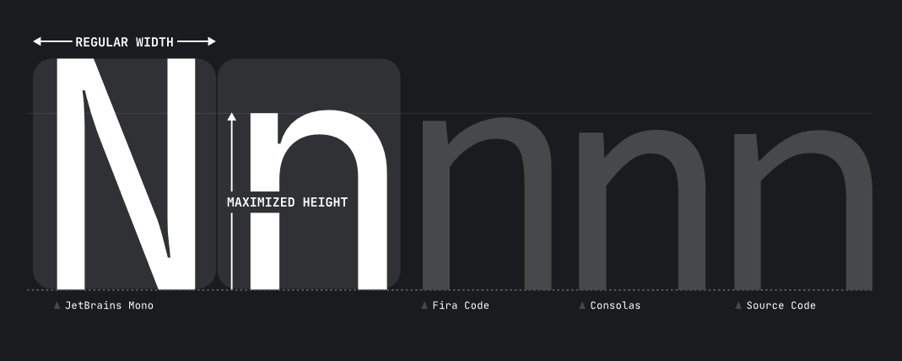

JetBrains is a company well-know for all developers. They have an impressive portfolio of dev tools among which the most popular ones are definitely IntelliJ (Java IDE) & Kotlin programming language.

JetBrains doesn't slow down in 2020 and they have just published their new product which is ... a font!
But not any font, its a font created by developers for developers and I must say ... **IT'S AWESOME!**

##### Source: [jetbrains.com](https://www.jetbrains.com/lp/mono/)

## Increased readability

Why this font is so special? **It's simple.**

**JetBrains Mono**’s typeface forms are free from unnecessary details which makes them easier to process for our brains. A number of specific typographic procedures have been performed **to increase the readability** such as:

- increasing the height of lowercase letters,
- easier distinguishing similar characters ( e.g. 1, l, I or semicolon with a colon).

Besides a couple of readability improvements the font also provides:
- 138 code-specific ligatures
- support 143 language
- is available in 4 weights with matching italics
- is **FREE & OPEN SOURCE!**

Take a look!

If you love the concept of **JetBrains Mono** I have great news! 
It's available under the Apache 2.0 license and can be [downloaded from the JetBrains website](https://www.jetbrains.com/lp/mono/).
