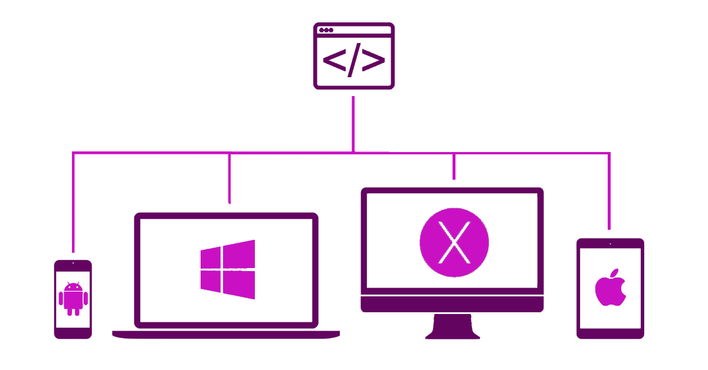

Low-code development platforms (LCDP) is a booming market which is predicted to grow from USD 4.3 Billion in 2017 to almost USD 30.0 Billion by 2022. What exactly are LCDPs?  LCDPs are application development platforms that provide rapid app delivery with coding reduced to the minimum and easy deployment. The main idea behind LCDPs is to reduce the time required from an idea to prototype, which is related to decreased project cost overall.

### Market data and predictions

The report provided by [MarketsAndMarkets](https://www.marketsandmarkets.com/Market-Reports/low-code-development-platforms-market-103455110.html) identify that rising demand for customer-centric web and mobile applications fuels the rapid growth of the [Low-Code Development Platform](https://en.wikipedia.org/wiki/Low-code_development_platform) Market across the globe. Obviously, the largest geo-market for LCDPs is North America. Whereas, Asia Pacific (APAC) was identified as the fastest growing one. The rising demand for automation and innovation in many different industries requires:
- Faster development process (both web and mobile application),
- Easier Deployment,
- Cost reduction.

All the above is expected to push the low-code development trend into its highest high in the next couple of years.

### Low-code development pros

#### Development time

LCDPs are visual-based design system which means that the amount of coding is often reduced to zero and that of most of it is replaced by a draw/drag-and-drop system. This allows building apps faster and results in shorter time-to-market.

#### Development cost

The ability to build an MVP faster means a cost decrease.  Moving further, LCDPs can reduce requisition for developers work. This results in lower personnel costs, directly and indirectly (office costs, HR personnel costs). The tricky part is that if the personnel cost reduction goes too far, it can easily turn into a clear disadvantage.

#### Cross-platform
As time users spend on their smartphones or tablets has closed the gap with desktop, the modern applications must have cross-platform functionality standard built-in in their design. Automatical deployment over multiple platforms with none or almost zero effort is one of the LCDPs biggest features.

	
### What about the cons?

#### Security
Security is one of the LCDPs main flaws. As by default, low-code development platforms aim for small or medium customers. The security provided by them is often fine for non-commercial or small commercial projects. Although some platforms claim to have enterprise-level security procedures and certifications, it’s most of the time not enough to be trusted by large-scale commercial projects.

#### Scalability & compliance
Along with security, LCDPs platforms scalability is often questioned. Applications built so quickly at high risk of lack of adequate management which might cause some serious compliance issues later on. Many IT professionals remain skeptical about that low-code development platforms as they don’t address the challenge of increasing complexity due to changes, therefore they shouldn't be a platform of choice for any large-scale enterprise applications.

### Summary
Low-code/no-code is a very strong trend in modern IT projects. Although it's becoming more & more popular across private or small commercial projects it will be hard to be popularized it across large-scale enterprise projects where security is a top priority.

