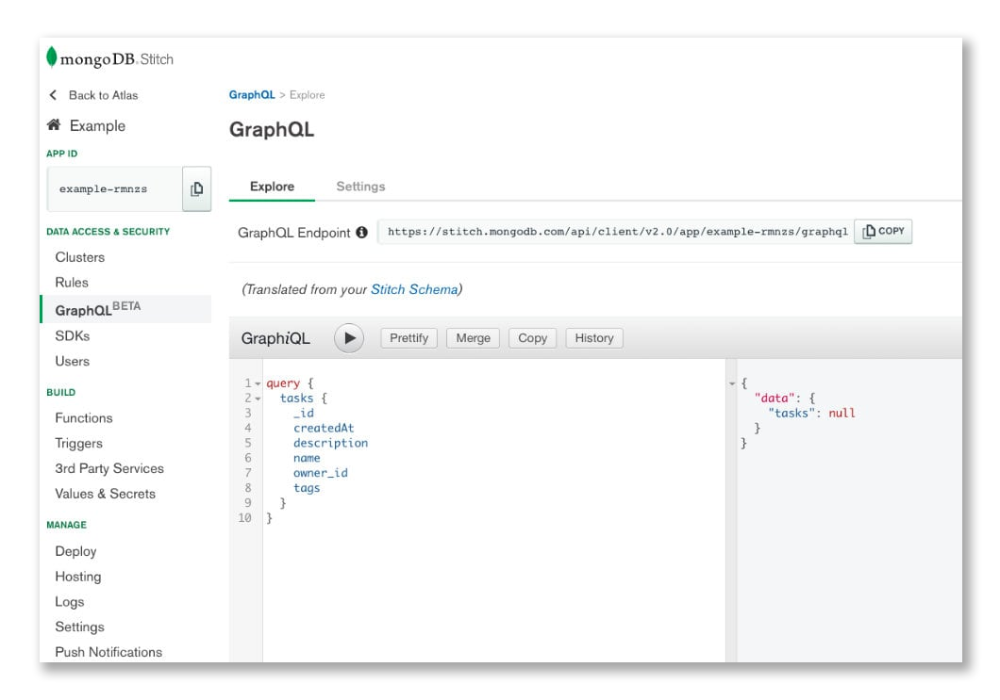

A while ago **MongoDB announced GraphQL integration** in one of their products. It's a piece of huge news & another token of recognition for GraphQL. MongoDB team sees a great opportunity in this integration as they believe to not having to create a custom backend implementation of GraphQL can save thousands of development teams a lot of effort and resources. GraphQL support was launched for MongoDB Atlas, as integration with **MongoDB Stitch** which acts as both the GraphQL client and server.


## What's GraphQL

**GraphQL is a data query language** that offers a declarative query ability via API comparing to typical REST API implementation, which returns a full payload of information. 

Some of the GraphQL benefits include:

- **smaller payloads** as it uses types to make sure client ask only for data that can be returned,
- **better performance on slower connections** thanks to a reduced number of bits transferred over the wire,
- **quicker MVP builds** as GraphQL provides a single endpoint for flexible & more efficient data access & management.


## GraphQL + MongoDB Stitch

**MongoDB Stitch** is the serverless platform offered by MongoDB. As for every serverless, its main premise is:


> *Write less code and build apps faster*

and the way of achieving this is to write less code (obviously) by using all the good stuff (**now also GraphQL!**) offered by **Stitch SDK** like authentication, access rules, MongoDB queries, services, functions & more.

```js
// Install with npm:// npm install mongodb-stitch
// Then simply add the Stitch SDK to your application

import {
  Stitch,
  AnonymousCredential,
  RemoteMongoClient
} from 'mongodb-stitch-browser-sdk'

// 1. Connect to MongoDB
// It’s simple to point Stitch to a MongoDB collection
const stitchClient = Stitch.initializeDefaultAppClient('myApp');

// Connect to a MongoDB Atlas database
const db = stitchClient
  .getServiceClient(RemoteMongoClient.factory, 'mongodb-atlas')
  .db('production');

 // Anonymously authenticate, then add and retrieve documents.
stitchClient.auth.loginWithCredential(new AnonymousCredential())
  .then(() =>
    db.collection('items').insertOne({
      owner_id: stitchClient.auth.user.id,
      number: 42
    })
  ).then(() =>
    db.collection("items").find({}).asArray()
  ).then((docs) =>
    docs.forEach((doc, index) =>
      console.log(`${index}: ${JSON.stringify(doc)}`)
    )
  );
```
##### Source: [mongodb.com](https://www.mongodb.com/cloud/stitch)

If you want to play with Stitch SDK & GraphQL make sure to check out the official [introduction to GraphQL support in MongoDB](https://www.mongodb.com/blog/post/introducing-graphql-support-in-mongodb-atlas-with-stitch) where you will find:

- a step by step setup guide 
- an overview of new GraphQL related features in Stitch Dashboard (i.e. integrated **GraphiQL interface**)
- as well as some cool examples projects




