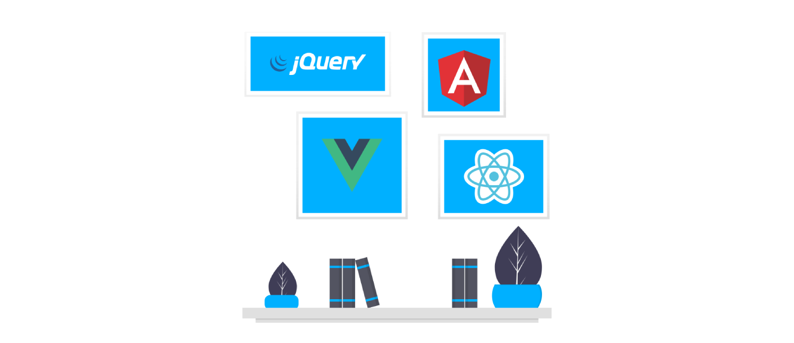

<sub> *A guest blog post for [GraphQL Editor blog]
(https://blog.graphqleditor.com/) by Marcin, Adam & Norbert from [InfoTech](https://technikum.infotech.edu.pl/)* </sub>

---
Awaited by everyone, the ninth version of Angular carries with it a lot of news and features. Primarily, Ivy became official compiler and functionalities brought into it, significantly improved performance and also streamline the process of debugging, testing and building web applications. In addition, changes were made to the entire framework. 

## Project Ivy has arrived

[Angular](https://angular.io/) is one of the best open-source frameworks that allows building web apps. Developed by Google, it has evolved over the years into versatile framework development, having all the necessary tools and resources to create web applications. 

The biggest change introduced in Angular 9 is the replacement of the existing ViewEngine (VE) compiler with the [Ivy compiler](https://angular.io/guide/ivy). In short, it is a tool that will be crucial for the further development of Angular and that has allowed eliminating several errors with large bundles and application performance resulting in a significant performance jump.


##### Source: [undraw.co](https://undraw.co/)

In Angular 8 to activate Ivy you had to add the following lines in the tsconfig.json file:

```
"angularCompilerOptions": {  
  "enableIvy": true  
}
```

In Angular 9 as Ivy became the default compiler this is no longer necessary. Ivy is radically different from anything we have seen in mainstream frameworks because it uses incremental DOM, and it upgraded since 8th versions and offers numerous advantages as:

- Improved building,
- Easier debugging,
- Faster testing,
- TypeScript 3.7 support,
- Improved type checking,
- IDE & language service improvements.

and our personal favorite which is ...

## Improved bundle size

Ivy is reducing the size of JavaScript packages which is a great improvement for programmers trying to speed up their applications. Smartphones and other similar mobile devices make up about half of the websites' traffic worldwide. A large proportion of these mobile devices gain access to websites from locations with slow internet connections. Sadly this is still a major issue that needs to be considered while building an app. Rebuilding existing API to reduce the number of resources they need to download and increase application performance for mobile users could turn out to be quite costly and can pose an unexpected risk to their projects. Of course, there is always a [GraphQL](https://graphqleditor.com/) but since you need to convince your team first it takes time. Taking all that improved bundle size feature turns out really useful! If you would like to check in detail what has changed make sure to visit angular's [official blog about the Angular 9 update](https://blog.angular.io/version-9-of-angular-now-available-project-ivy-has-arrived-23c97b63cfa3).


##### Source: [angular.io](https://blog.angular.io/version-9-of-angular-now-available-project-ivy-has-arrived-23c97b63cfa3)

## Update today

It’s the biggest actualization for about three years, so do not feel overwhelmed. 
If you haven’t updated your projects yet, [update.angular.io](https://update.angular.io/) might come in handy! Certainly, working on a refreshed framework will be much more pleasant from now on. The mass of changes inevitably also heralds a lot of problems, but certainly, the next updates bring necessary corrections and patches. We wish you fruitful work! 

