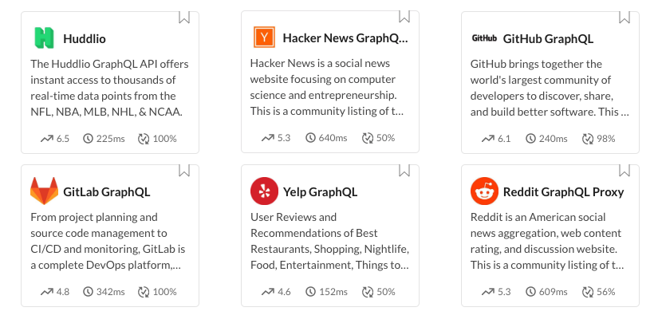

**[RapidAPI](https://rapidapi.com/) is the world’s largest API Marketplace** that helps developers find and connect to thousands of APIs.

RapidAPI was founded in 2014 by Iddo Gino and after two years on the market raised $3.5 million, then to grab a stunning amount of **$38 million in The Series B** (including $25 million from Microsoft).

Yesterday RapidAPI **announced support for GraphQL APIs** to its and has published the first batch of them. Right now the platform offers just a few GraphQL-based APIs including GitHub, GitLab, Yelp, Reddit or Hacer News, with a lot more coming soon.

RapidAPI deciding to provide its marketplace users a choice between native GraphQL and REST API is a very clear signal that that GraphQL's market position is on a rise and will play an important role in the future of APIs.

Developers using RapidAPI will get access to **GraphQL-native experience** allowing them to explore schema, develop, build & test their queries along with the same benefits known for RapidAPI users from its REST API experience:

- Publishing APIs via introspection or by uploading a schema file for easier onboarding,

- Interactive automatically generated docs enabling users testing the API right from a browser,

- Code snippets for easier integration with all the API provider’s applications,

- API management tools enabling to monitor performance metrics and data usage

