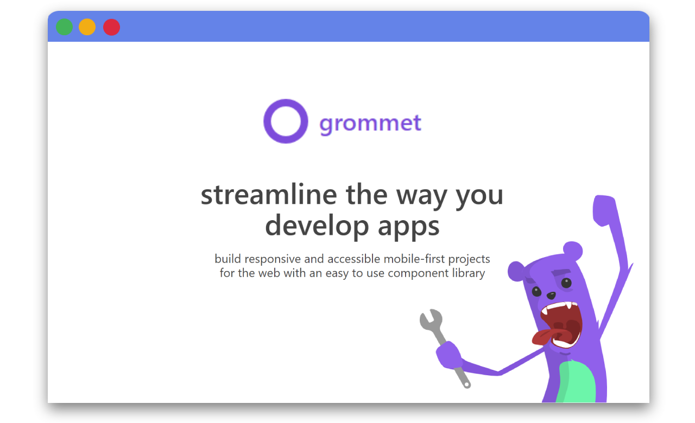
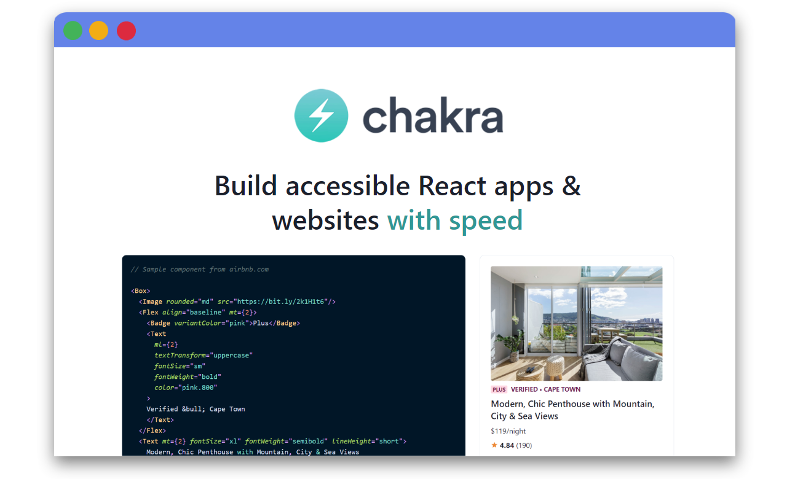
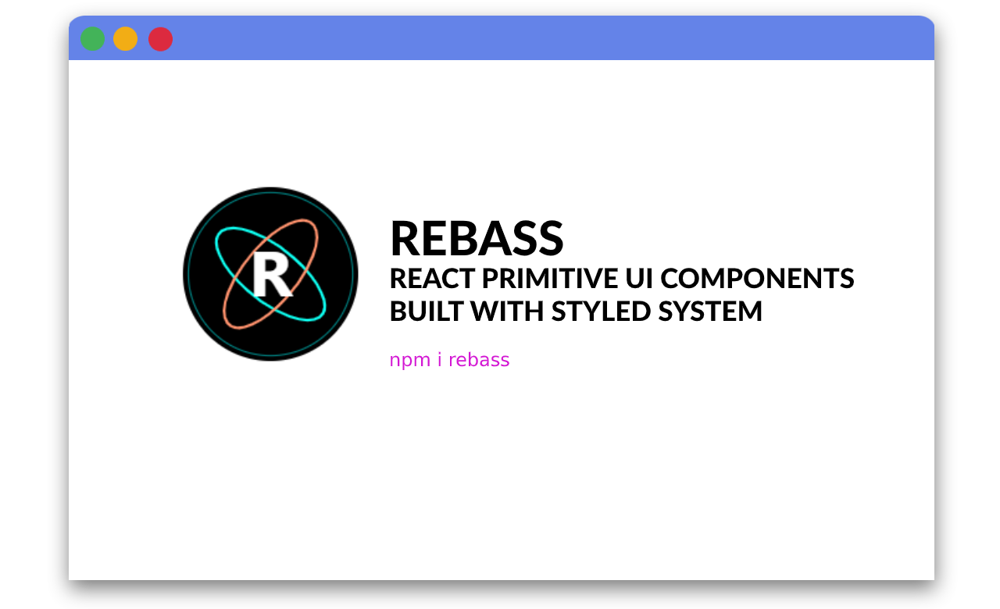
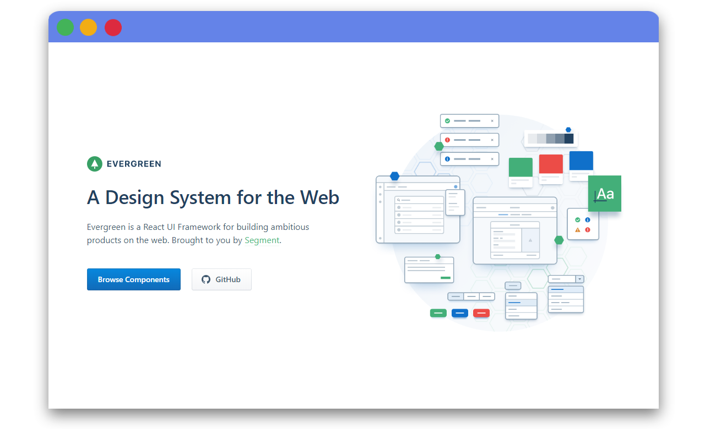
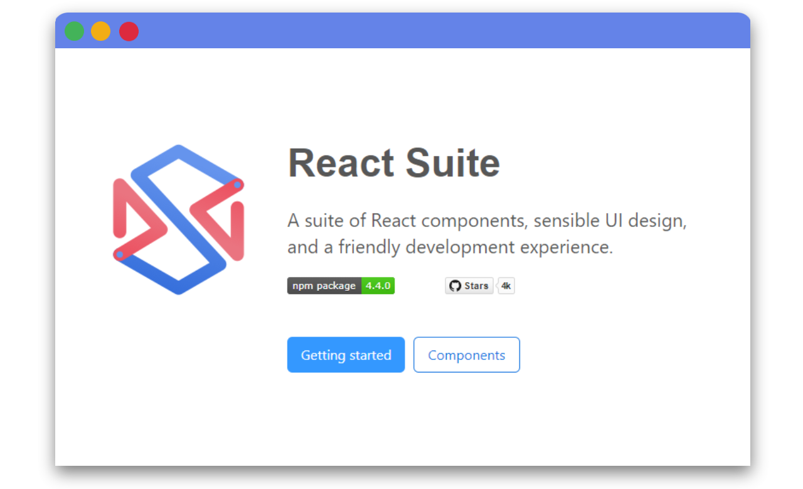

React is one of the most popular web frameworks. Well, not exactly a framework but rather a frontend library but it’s often described this way and usually being mentioned or compared to other frameworks.

What's special about React is that it first introduced us the component-based architecture giving the direction for the web development industry. Seeing how well it was received, many other frameworks decided to adopt this approach as well.

React's modular nature created an ecosystem of UI libraries that is growing rapidly. You probably all know the most popular ones:

- [Material UI by Google](https://material-ui.com/),
- [React Bootstrap](https://react-bootstrap.github.io/),
- [Blueprint UI](https://blueprintjs.com/),
- [Ant Design](https://ant.design/),

but there are plenty of smaller/less known libraries which are also awesome. Let's take a look at some of them! 

## Grommet

[Grommet](https://v2.grommet.io/) is a React-based framework that allows you to tailor the component library to align with your product/company style. The accessibility & modularity provided by Grommet allows you even to control the way your components interact with each other. Along with a framework you get access to icons assets pack as well as some experimental features like *Grommet Designer* which allows you to build your components using a dedicated interface or *Grommet Themer* a useful tool to import your company style details into Grommet designer.

[GitHub](https://github.com/grommet/grommet) | [Website](https://v2.grommet.io/)

## Chakra UI

[Chakra UI](https://chakra-ui.com/) is another simple and very accessible component library for React. Chakra UI strictly follows the standards, all components come with proper attributes and keyboard interactions out of the box giving all the building blocks you need to build your new awesome React app!

[GitHub](https://github.com/chakra-ui/chakra-ui) | [Website](https://chakra-ui.com/)

]

## Rebass

[Rebass](https://rebassjs.org/) is a  very simple yet powerful UI components library featuring simple & quickly accessible mobile-first responsive styles with array-based syntax. Rebass contains only 18 essential, light-weight components based on the Styled System library. Easily customizable, capable of creating very powerful things, Rebass is being described as the "Bootstrap of React". Sounds promising right?

[GitHub](https://github.com/rebassjs/rebass) | [Website](https://rebassjs.org)

]

## Evergreen

[Evergreen](https://evergreen.segment.com/) is a React UI Framework maintained by Segment for building beautiful web products. It contains a set of components working out of the box. Evergreen's components are built on top of a React UI Primitive which makes them highly flexible & comparable. If you are looking for a production-grade UI set for your projects Evergreen is a great choice!

[GitHub](https://github.com/segmentio/evergreen) | [Website](https://evergreen.segment.com/)

## React Suite

[React Suite](https://github.com/rsuite/rsuite) is a suite of well-designed  React components. React SUite offers components designed attention to detail as well as a developer-friendly UI environment. React Suite is a set of ready-to-go libraries suiting even the most sophisticated enterprise product needs. 

[GitHub](https://github.com/rsuite/rsuite) | [Website](https://rsuitejs.com/en/)

