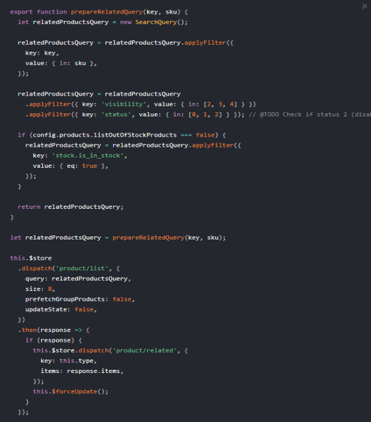

**Progressive Web Apps are the ultimate way to create ultra-fast webpages and apps with a mobile-first approach. Engaging for mobile users, PWAs are also an attractive technology for developers as they leverage modern JS frameworks and tech stack, including GraphQL.**

The story of progressive web apps starts with the PWA manifest announced by Google. In a single document, Google listed all the technical requirements and other things that make Progressive Web Apps reliable, fast and engaging. 

Following this list helps developers to build high-quality PWAs step by step, which might be time-consuming and require some knowledge on the edge of web and app development that is not always available in teams.

## Ready-to-use solutions for Progressive Web Apps

The other way is to leverage ready-to-use PWA solutions, which are popping out on the market at breakneck speed. Doing so guarantees a faster time-to-market, a bunch of additional modules and support of development.

There at least several solutions that ensure high-quality progressive web apps, such as Deity Falcon, Scandiweb or Vue Storefront, just to name a few. Apart from these independent solutions, leading CMS and eCommerce platform providers are also working on their own integrated PWA solutions (Magento, SAP Hybris).

Which of them supports [GraphQL](https://graphql.org/)? Here’s the list!

## PWA solutions supporting GraphQL

### [Deity Falcon](https://falcon.deity.io/docs/getting-started/intro)
A PWA solution developed in the offices of The Netherlands-based startup - Deity. It is suitable for all sorts of online sites – webshops, blogs, and bigger platforms. 

**Frontend base:** *React*  
**Integrated backends:** *Magento 2, Wordpress*  
**Technologies inside:** *Node.js, GraphQL, React, Apollo, Koa, Webpack, Jest*  
**Projects live:** *2*  
**Github stars:** *313*  
**Github repo:** *https://github.com/deity-io/falcon* 

### [PWA Studio](https://magento.github.io/pwa-studio/)
This one is more like a set of tools, rather than a ready-to-use solution. Developed by Magento, one of the leading eCommerce platform solutions, it gives a good base to build PWA solutions adjusted to individual business needs. It is still in its alpha phase, with strong support from the Magento community.

**Frontend base:** *React*   
**Integrated backends:** *Magento*   
**Technologies inside:** *Webpack, React, Redux, GraphQL*  
**Projects live:** *2*  
**Github stars:** *420*  
**Github repo:** *https://github.com/magento-research/pwa-studio* 

### [Scandiweb PWA](https://scandipwa.com/)
A PWA solution developed by the Scandiweb agency since 2018. The solution provides a progressive web app for Magento-based stores.

**Frontend base:** *React*  
**Integrated backends:** *Magento 2*   
**Technologies inside:** *Redux, Webpack, React, GraphQL, SCSS*  
**Projects live:** *1*  
**Github stars:** *35*  
**Github repo:** *https://github.com/scandipwa* 

##### Source: [Example of building a Query in Vue Storefront](https://docs.vuestorefront.io/guide/basics/graphql.html)

### [Vue Storefront](https://www.vuestorefront.io/)
Probably the fastest-growing open-source PWA solution with strong community support. A PWA solution dedicated to multiple eCommerce platforms with a long list of payment, basket, checkout and other modules crucial to building performant online stores. 

**Frontend base:** *Vue.js*  
**Integrated backends:** *Magento 1, Magento 2, Shopware, Pimcore, CoreShop, WordPress,EpiServer, SpreeCommerce, Odoo ERP, BigCommerce, boilerplate*   
**Technologies inside:** *Vue.js, Node.js, ElasticSearch, Webpack, GraphQL*  
**Projects live:** *15+*  
**Github stars:** *4903*  
**Github repo:** *http://github.com/DivanteLtd/vue-storefront* 

---

If you are looking for a more detailed tech comparison, with middleware, server-side rendering, and test tools, there is an excellent summary of [available PWA solutions](https://divante.com/blog/pwa-solutions-for-ecommerce-comparison/).
