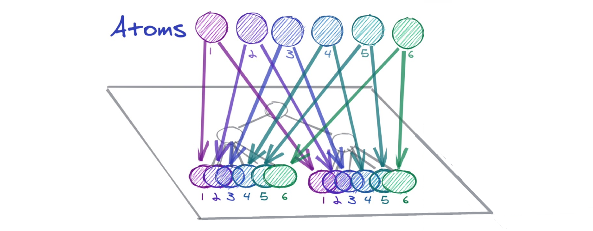

For many reasons, it's wise to use React's built-in state management capabilities rather than an external global state like compatibility, simplicity etc. Unfortunately, it has some limitations like:

- Context can only store a single value
- Component's state can only be shared by pushing it up to the common ancestor 

These make it difficult to code-split the parts of the React three where the state has to live from where the state is used. Just a few days ago **Facebook had open-sourced it's state management library** that could above mentioned limitations.

## Recoil

[Recoil](https://github.com/facebookexperimental/Recoil) is an experimental state management library for React apps aiming to improve the above-mentioned flaws of React's built-in state management while keeping the API, the semantics & behavior as *Reactish* as possible. Recoil provides several capabilities that are difficult to achieve with React alone while being compatible with the newest features of React.

>*Recoil defines a directed graph orthogonal to but also intrinsic and attached to your React tree. State changes flow from the roots of this graph (which we call atoms) through pure functions (which we call selectors) and into components.*

## Atoms & Selectors

The core concept of Recoil is the data-flow where data travels from `Atoms` (shared state) through `Selectors` (pure functions) down into React components building your app.



##### Source: [David McCabe @ recoiljs.org](https://recoiljs.org/)

**Atoms are units of the state** that components can subscribe to. They contain the source of truth for our application state.  **Selectors transform this state either synchronously or asynchronously**. Atoms are created by using the `atom()` function:

```react
const fontSizeState = atom({
  key: 'fontSizeState',
  default: 14,
});
```
##### Source: [recoiljs.org](https://recoiljs.org/docs/basic-tutorial/intro)

A *selector is a pure function* that accepts atoms or other selectors as an input. When these inputs are changed, the selector function will be re-evaluated. React components can subscribe to selectors and when the selectors change they will re-rendered as well. 

Selectors are defined using the `selector()` function:
```react
const fontSizeLabelState = selector({
  key: 'fontSizeLabelState',
  get: ({get}) => {
    const fontSize = get(fontSizeState);
    const unit = 'px';

    return `${fontSize}${unit}`;
  },
});
```
#### Source: [recoiljs.org](https://recoiljs.org/docs/basic-tutorial/intro)

The approach presented by Recoil offers:

- boilerplate-free API where the shared state has the same simple get/set interface as React local state,
- compatibility with Concurrent Mode and other new React features as they become available,
- code-splitting possibility thanks to incremental & distributed state definition,
- the state can be replaced without modifying the components that use it.
- derived data can move between being synchronous and asynchronous without modifying the components that use it.
- backward-compatibility of application state; persisted states can survive application changes.


**Recoil** works and thinks just like React providing a **fast & flexible** shared state.  Add Recoil to your app and check how it will influence its state management. 
