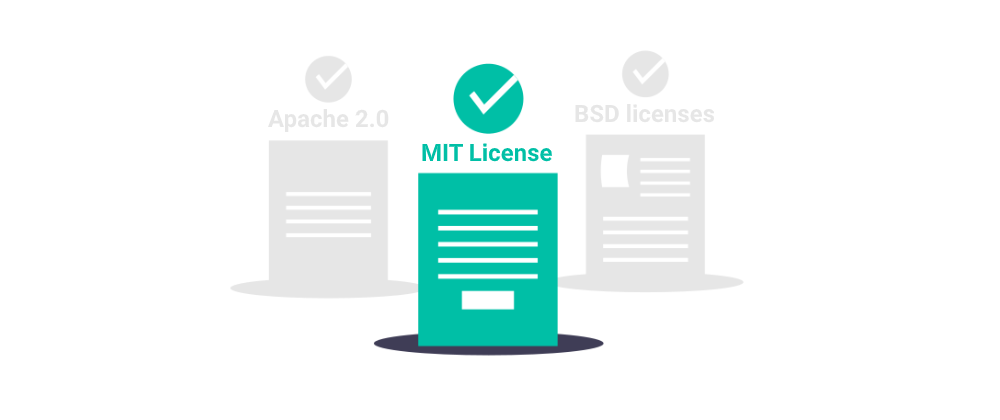
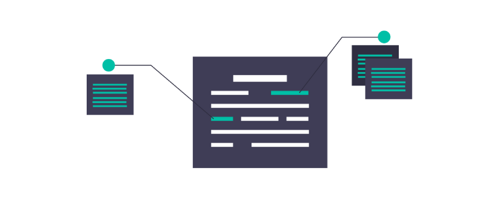

If you’ve ever made an app, program, or just written some code, chances are you’re familiar with terms like open source, freeware, and proprietary. You usually find them in the software license. Comprehending license is very important as the penalties for license noncompliance can be severe. There are many different types of software licenses, but today let's focus on the basic types you need to understand.

In general, there are 5 types of software licenses: 

- permissive, 
- protective, 
- non-commercial, 
- proprietary,
- public domain.

Those determine how the subject software can be used or redistributed, the license will state exactly what the user can and can't do with the software. What these types mean and which one you should pick for your software? So let’s break them down using some well-known examples.

##### Credits: [undraw.co](https://undraw.co/)

## Public Domain

The public domain is the most straightforward of the bunch. It’s not exactly a license, it’s more accurately a waiver of property rights. The author simply donates his work to the public domain. That means there is no copyright, patent or trademark and the software is free for use, modification, distribution or sale without any restrictions or even mentioning the original author. According to analysts, the public domain is the 7th most popular type of license used mainly in smaller SourceForge and GitHub projects. 

License examples:
- Creative Commons CC0
- Unlicensed
- BSD0

Software examples: SQLite, I2P, ImageJ

## Proprietary license

That’s your traditional run of the mill copyright. The user pays and is able to use the software within the limitations set by the license. The limitations can be various: 

- a timed subscription 
- one user per license
- DRM
- user tiers (standard, gold, platinum etc.)

The most well-known example is, of course, Windows with various editions of their system like Home, Pro or Enterprise. Other examples include Skype, macOS and Adobe Photoshop.

## Permissive licenses

By far the most popular type of license, this group contains some of the most commonly used licenses like MIT or BSD. A permissive software license allows everyone to use, share and modify the software for free as long as they credit the original creator. However derivative work can later be relicensed under a different license and made proprietary. So someone who uses your free software to create their own can charge others for it. That’s why while Android is free, apps made using it can be sold on the market.

License examples: 
- MIT License
- Apache 2.0
- BSD licenses

Software examples: .NET Core, Django, React

##### Credits: [undraw.co](https://undraw.co/)

## Protective licenses

Also known as copyleft, these licenses also allow free use, copying and modification of the software with credit to the original creator. The main difference from other types of licenses is that under copyleft all derivative work also has to follow the same copyleft license ie. be free for use, copying and modification. Copyleft is covered under the GNU family of public licenses GPL, LGPL and AGPL. As far as software is concerned Linux, GIMP and MySQL are some pretty widely known examples.

License examples:
- GNU General Public License
- Mozilla Public License
- Eclipse Public License

Software examples: Notepad ++, WebKit engine, Launchpad

## Non-commercial licenses

Also known as freeware or freemium, the key difference here is that ‘free’ in freeware refers to the price, not the actual freedom of usage like the above-mentioned licenses. While the price is free the license can restrict usage or offer additional features for payment. Some popular games like League of Legends use this model by providing the base game for free and having microtransactions for various items, cosmetics and bonuses. Others use popups, ads or other means to convince the user to upgrade from free to premium. 

## Summary

So now the next time you see that you’ll know exactly what type of license it is, before once again clicking close. Next time we’ll take a more in-depth look at the various types of licenses, compatibility and stuff like dual-licensing. Stay tuned!

