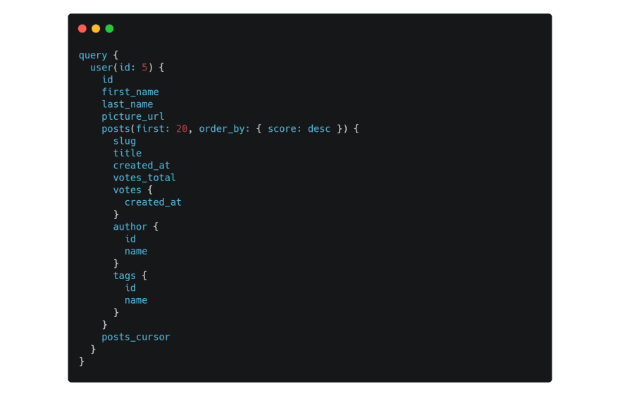

**[Super Graph](https://supergraph.dev/docs/home)** is a service that creates a high-performance GraphQL API, all happens instantly and without any code. The core concept of Super Graph is to reduce development time by simplifying database operations and it's achieved by translating your [GraphQL queries](https://graphql.org/learn/queries/)  into a single & blazingly fast SQL query.

>*It aims to cut development time by reducing the boilerplate when developing GraphQL APIs that use an SQL database.* 

By giving GraphQL API for PostgreSQL database written in Go, Super Graphs aims to reduce development time when developing GraphQL APIs that use refers to a SQL database by automatically generating SQL queries along with some most commonly used features such as authentication, Rails integration, remote joins, support for JWT tokens, DB migrations, seeding and more.

>*Super Graph will learn your database and generate the most efficient SQL query.*

Instead, just describe the data you need in GraphQL and give that to Super Graph it'll automatically learn your database and generate the most efficient SQL query fetching your data in the JSON structure you expected.

###### Source: [supergrapqh.dev](https://supergraph.dev/docs/home)

And as a result of data fetched by Super Graph you will be given a JSON with all the data needed without writing any code or SQL.

###### Source: [supergrapqh.dev](https://supergraph.dev/docs/home)

## Why Super Graph?

The creator of Super Graph, [Vikram Rangnekar](https://twitter.com/dosco), found that on average developers spend too much time on building API backends (development, updating, maintenance) and it always comes to figuring out what the UI needs then build an endpoint for it which always comes with a struggle with providing the data in the form that the frontend expects to see. Being weary by the idea of writing the same code again and again he decided to build a compiler that converts GraphQL to highly efficient SQL.

The above-mentioned compiler is the heart of Super Graph providing everything you needed for your app. No more spending weeks or months writing backend API code. Just make the query you need and Super Graph will do the rest.
