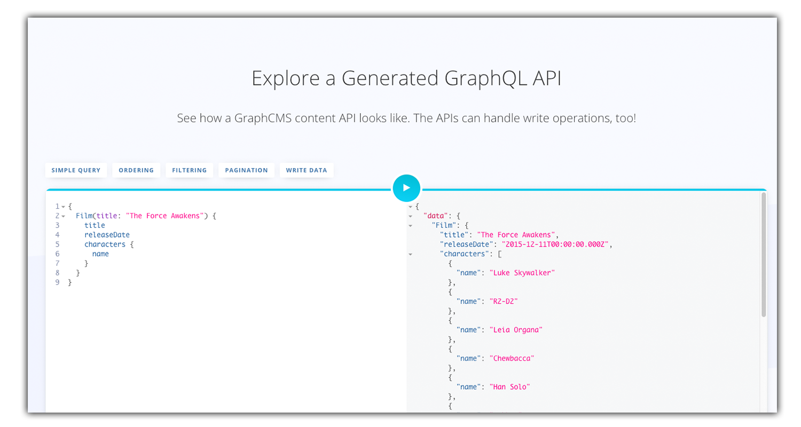
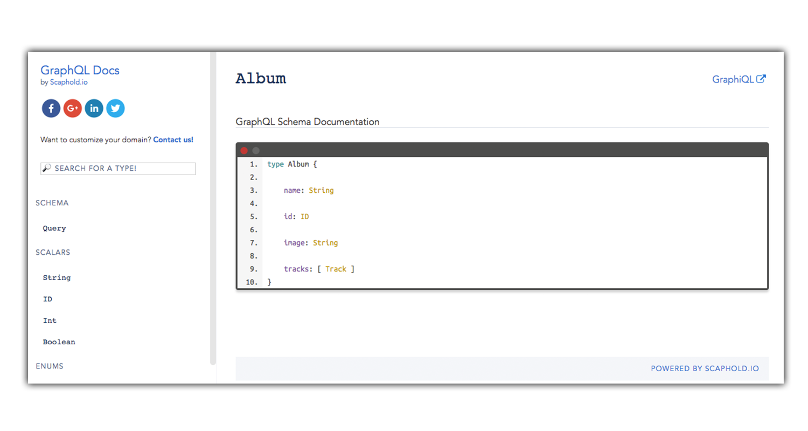
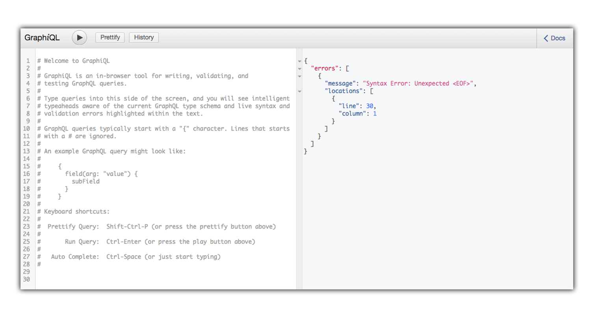
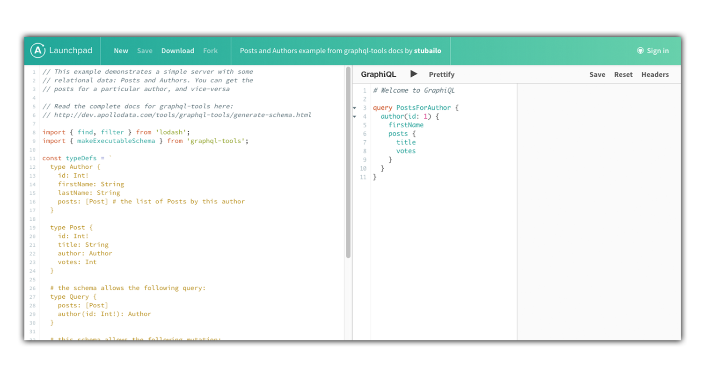

The recent rise of GraphQL popularity created an ecosystem of different supplementary tools having one idea in common - making GraphQL easier to adopt for more and more developers by bridging the implementation gap which is still a big issue.

If you have heard about GraphQL but still haven't decided to undergone the REST API to GraphQL transformation this tools will make a decision a lot easier.

### [GraphCMS](https://graphcms.com/)

A tool which allows you to define your GraphQL API. Create structures, relations, powerful permissions and manage your content at ease. So, in general, you can build a hosted GraphQL backed for your web project along with tooling to manage its content.

### [Tipe](https://tipe.io/)

Tipe allows you to build your apps without managing the content. Just create a GraphQL schema file and Tipe will generate your API, content model and the editor UI. Thanks to Tipe you can prototype locally.

### [GraphQL Docs](https://github.com/2fd/graphdoc)

GraphQL Docs will generate simple static documentation for your GraphQL schema in couple seconds giving you an option to keep your API documentation private or make it publicly available.

### [GraphiQL](https://github.com/graphql/graphiql)

An easy to implement  React-based IDE tool for testing and documenting GraphQL APIs. GraphiQL provides a graphic interface for your GraphQL API that takes performing queries and mutations to a new level.

### [Apollo Launchpad](https://launchpad.graphql.com/new)

A tool take makes GraphQL code very accessible. Apollo Launchpad makes it possible to write a GraphQL schema example in JavaScript and create a serverless GraphQL endpoint.

