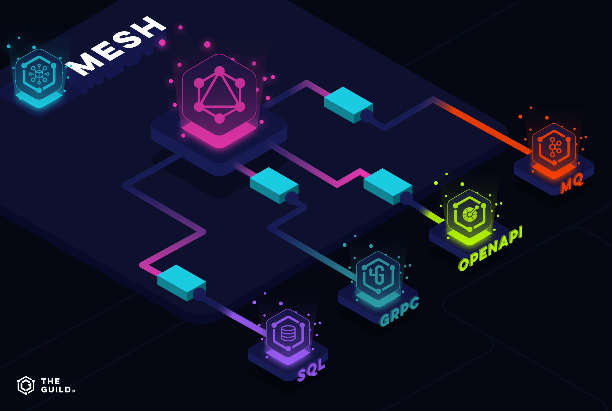

The Guild is an open-source group focused on enabling developers to maximize the benefits offered by GraphQL. [The Guild](https://github.com/the-guild-org/Stack) stands behind such notable GraphQL libraries as:

- GraphQL Code Generator
- GraphQL Inspector
- GraphQL-CLI

and other useful packages. A couple of days ago the Guild revealed their latest project - **[GraphQL Mesh](https://github.com/Urigo/graphql-mesh)**.

## GraphQL Mesh

I believe this library may solve one of the most important issues standing in the way of global GraphQL adoption which is a fear of the unknown. The reason many developers haven't decided to try GraphQL is some uncertainty about the possible implementation issues that might arise during the transition process, with GraphQL Mesh you can easily use GraphQL specification with legacy API services!

##### Source: [Medium/The-Guild](https://medium.com/the-guild/graphql-mesh-query-anything-run-anywhere-433c173863b5)

## How it works

**GraphQL Mesh** is an open-source library with a goal to provide developers access to services using other API specifications like **openapi/Swagger, json-schema, SOAP, gRPC, SQL, Mongoose, GraphQL, Federated GraphQL, queue systems, SQL** with GraphQL queries, mutations & subscriptions without changing the source service.

In short GraphQL Mesh takes your existing services’ APIs specification and tries wrapping it with a GraphQL layer. But it doesn't stop here. GraphQL Mesh allows you to easily extend or modify your new schema, providing a fully-typed GraphQL SDK. This makes working with your new schema a lot easier as you are sure on any step that you are using the right object structure.

## Local schema vs Gateway

The output of GraphQL Mesh is a generated code that you can use both ways as:

- **Local Schema** - import it from the autogenerated directory and use GraphQL execute to run queries and mutations locally in your application putting GraphQL engine in charge of fetching & running data from your source API.

- **Gateway** - use your new schema as a shared gateway for multiple applications and run it on your own server which would be responsible for all schema operations.

Whatever you prefer to make sure to check a [detailed description of how it works & usage examples](https://medium.com/the-guild/graphql-mesh-query-anything-run-anywhere-433c173863b5) provided by the Guild & keep in mind that GraphQL Mesh is in still its early stage so there might some breaking changes coming.

Guild members have been using GraphQL Mesh for a while internally for their customers and they claim it has been a huge upgrade. If anything was holding you back from trying GraphQL now you have lost your excuse! Try GraphQL Mesh today :)
