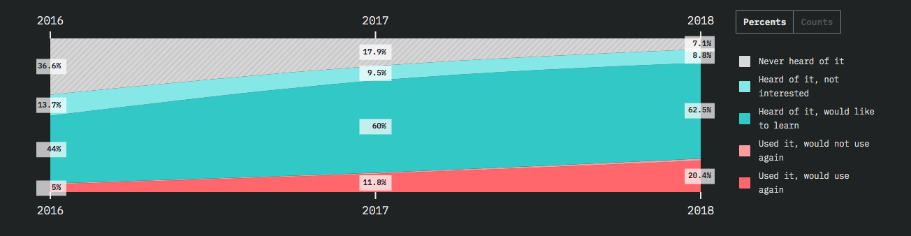
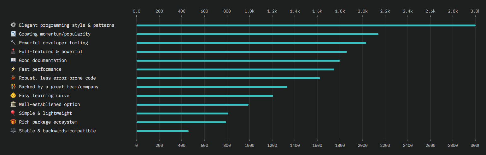
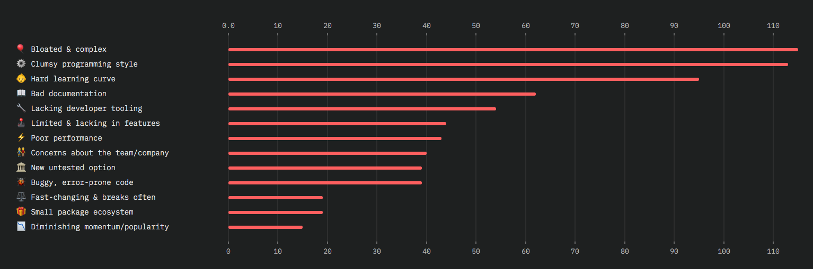
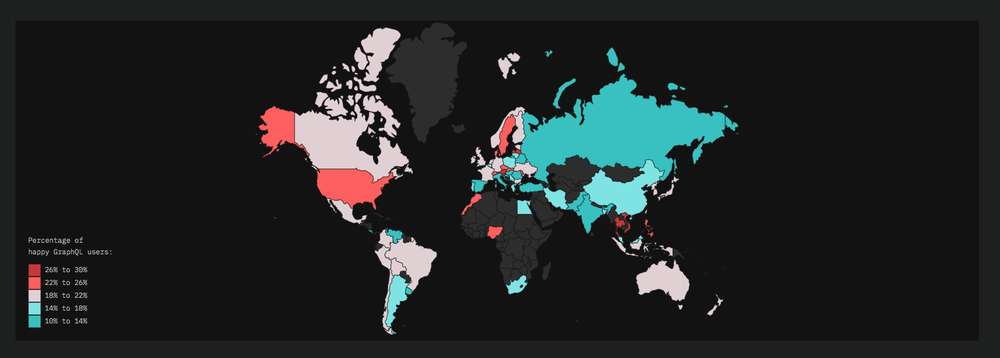
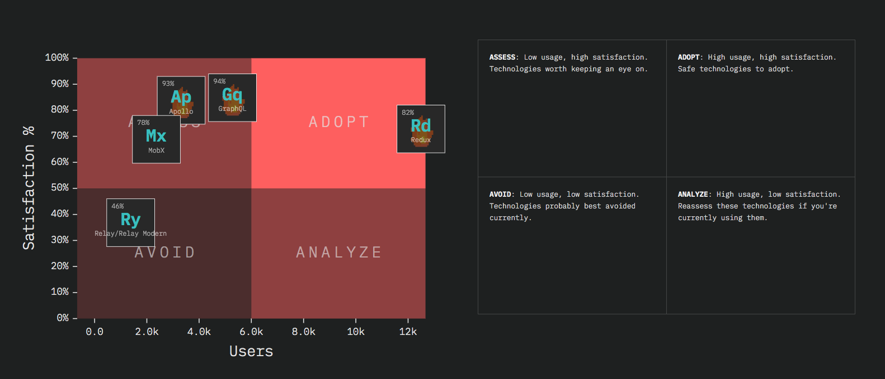

[The State of JavaScript](https://stateofjs.com/) is a survey created and maintained by [Sacha Greif](https://twitter.com/sachagreif), [Raphael Benitte](https://twitter.com/benitteraphael) & [Michael Rambeau](https://twitter.com/michaelrambeau). The survey collects data from over **20,000 developers**, who are asked questions regarding front-end frameworks, libraries and the part that interests us the most ... the Data Layer which of course includes the [GraphQL](https://graphql.org/) and its derivatives such as Apollo or Relay.

#### Data layers report

The data layer regroups all the technologies used to transmit and manage data. It's a vast category where many approaches compete to make a tricky problem more approachable. The users were asked about their experience and knowledge of such technologies as [Redux](https://redux.js.org/), [Apollo](https://www.apollographql.com/), [MobX](https://mobx.js.org/), [Relay](https://facebook.github.io/relay/) & [GraphQL](http://graphqleditor.com). Let's take a look at the responses from last year (2018) surveys:

#### GraphQL's popularity

As you can see on a chart below (hopefully), only 7.1% of the respondent has never heard of GraphQL (comparing to 36.% in 2016, and 17.9% in 2017). The 62.5% declare that they would like to learn the GraphQL, **20.4% used it and would use again** (which is a double growth comparing to 2017), and only 1.3% have already given it a try, but would not use it again.

##### Source: [stateofjs.com](https://2018.stateofjs.com)

#### Most like aspects of GraphQL

The developers who declared that they *“used it and would use again”*, when asked about the most liked aspects of GraphQL picked the below top3:
- elegant programming style & patterns
- growing popularity
- powerful tooling (i.e. [GraphQL Editor](https://graphqleditor.com/))

##### Source: [stateofjs.com](https://2018.stateofjs.com)

#### Most disliked aspects of GraphQL

The developers who declared that they *“used it and would not use again”*, when asked about the most disliked aspects of GraphQL picked:
- high complexity
- clumsy programming style,
- hard learning curve 

##### Source: [stateofjs.com](https://2018.stateofjs.com)

#### GraphQL Usage 

The survey showed that **20.3% of respondents have used GraphQL** and would do it again for future projects. Below map represent the distribution of users enjoying [GraphQL](https://graphql.org/). Countries with the highest ratio are shown in red, those where it's lower are displayed in blue. Countries with less than 20 respondents were omitted.

##### Source: [stateofjs.com](https://2018.stateofjs.com)

#### The summary

After analyzing over **20 000 surveys** the authors have put them into a quadrant chart where have four groups:

|Recommendation|Tech|
|-------|--------|
|**Adopt**|[Redux](https://redux.js.org/) - it has very high usage & satisfaction rates, which makes it a safe technology to adopt.|
| **Assess** |[GraphQL](https://graphql.org/), [Apollo](https://www.apollographql.com/), [MobX](https://mobx.js.org/) - they have high satisfaction, but still relatively low usage rate. These are the technologies worth following as they soon might transform into the big players.|
|**Avoid**|[Relay](https://facebook.github.io/relay/) - low usage, combined with low satisfaction makes Relay a technology to avoid (at least right now).|
|**Analyze**|NONE - high usage despite low satisfaction if being used you should consider reassessment.|

##### Source: [stateofjs.com](https://2018.stateofjs.com)

