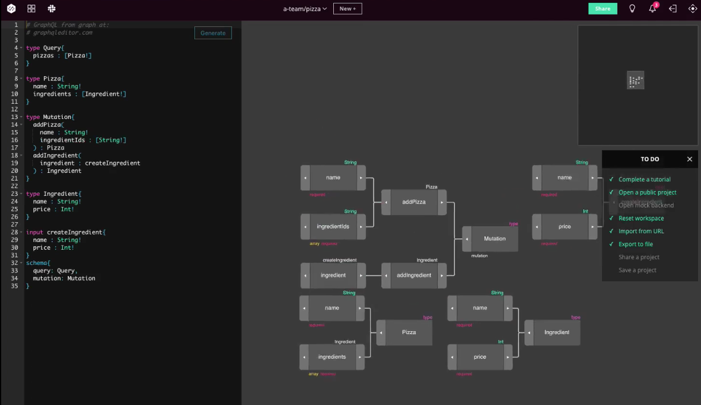

  
Some time ago I have read that:

> *GraphQL is really about collaboration, and the teams that get furthest are those who work closely together on their GraphQL API.*

This idea is very true but collaboration becomes a very tricky part of any development project where there are multiple teams involved. So a question arises, is there any way to make collaboration on a GraphQL API easier & more pleasant experience? I think that it's possible!

Let me introduce you three ways of strengthening your GraphQL API which might save your teams from jumping at each other's throats.


### #1 Install GraphQL Code Inspector

[GraphQL Inspector](https://graphql-inspector.com/) is a CLI tool from [The Guild](https://medium.com/the-guild) member [Kamil Kisiela](https://github.com/kamilkisiela/), that detects changes, similar or duplicated types, validates documents against a schema and looks for deprecated usage, everything as simple as this:

```
$ graphql-inspector diff OLD_SCHEMA NEW_SCHEMA
```

There is also a programmatic API available in case you want to build something on top of it on your own.


##### Source: [GraphQL Inspector](https://medium.com/the-guild/graphql-inspector-481c1a5ef616)


### #2 Use GraphQL Editor

The [GraphQL Editor](graphqleditor.com) is a tool to build, manage and collaborate on your GraphQL schema visually! It includes features that help you make sure that your GraphQL API and its clients are well-developed. The latest update introduced a couple more interesting features like:

- **Autocomplete for Queries**  - Create an auto-complete library for JavaScript or TypeScript with a built-in [GraphQL Zeus](https://github.com/graphql-editor/graphql-zeus) feature.

- **Schema versioning** - with a click of a button you can see & manage all changes.

- **Schema Libraries (Schema stitching done right)** - built-in GraphQL libraries allow you to create new GraphQL schemas from multiple underlying GraphQL APIs.

- **Fake backend** - allowing you to run a GraphQL Server with faked data available for testing with a single click.

[](graphqleditor.com)


### #3 Why not use both?

Get your GraphQL API a bulletproof vest by combining these two tools!

