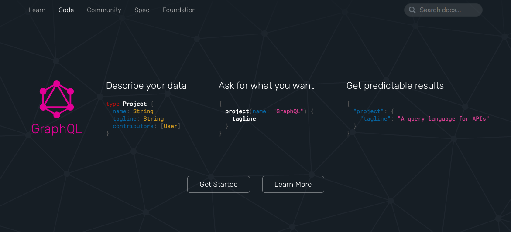
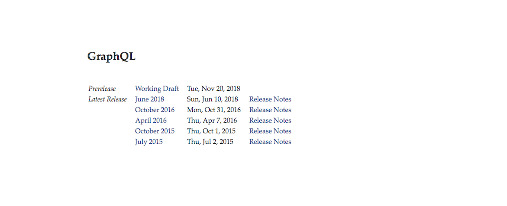
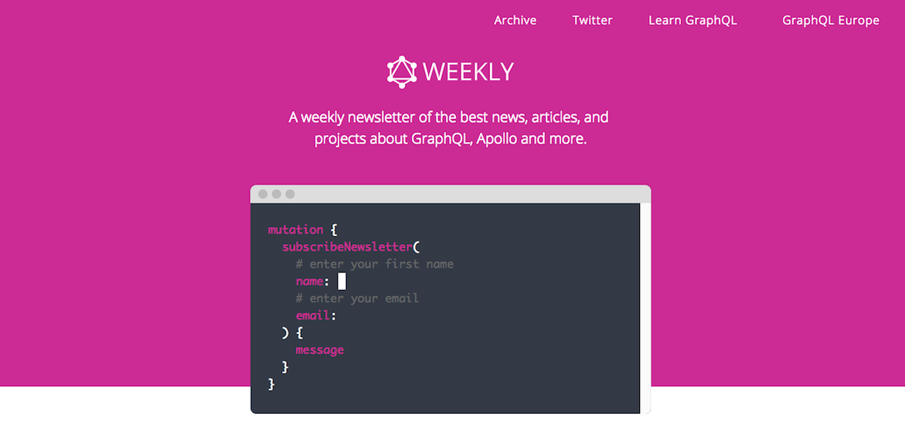
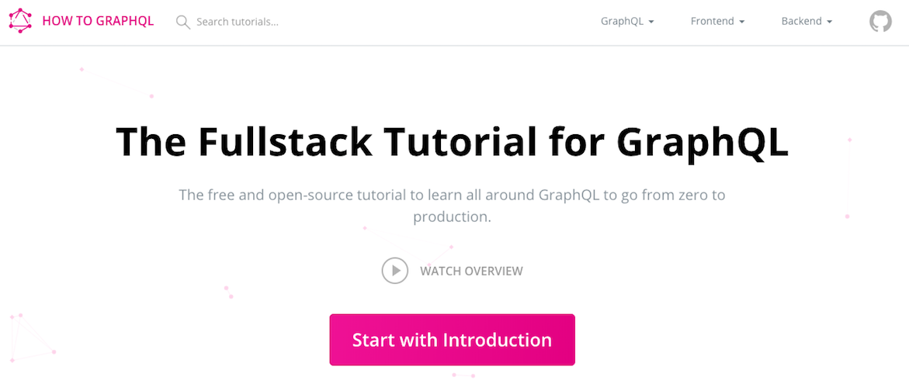
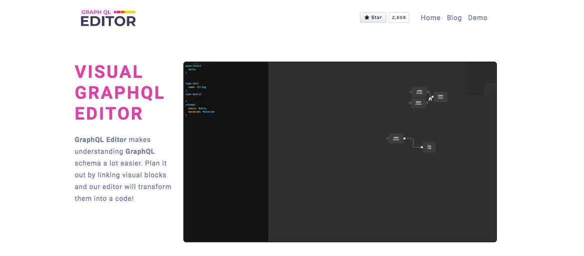

GraphQL is a new API query language is BIG. Since its introduction in 2015, it's userbase is continuously growing, but it gained real momentum when big players (Github, ProductHunt, Yelp, PayPal, Twitter) hopped on a GraphQL train. Right now there’re nearly 2 000 companies using GraphQL and this metric continue to grow.

Transferring from REST to GRapqHL might seem a little bit overwhelming at the begging, but it's totally worth it. 

To help you with that we prepared a list of TOP5 places with best tutorials and articles to help you start with GraphQL.

## 1. GraphQL Official Documentation  - https://graphql.org/learn/

The best place to start your GraphQL adventure.

## 2. Official Facebook Draft RFC Specification - https://facebook.github.io/graphql/draft/

Raw knowledge about the GraphQL project by Facebook.

## 3. GraphQL Weekly - https://graphqlweekly.com/

A weekly newsletter of the best news, articles, and 
projects about GraphQL, Apollo and more.

## 4. How to GraphQL - https://www.howtographql.com/

The Fullstack Tutorial for GraphQL which will take you into a fascinating journey from zero to releasing your first  GraphQL project.

## 5. GraphQL Editor Blog - https://blog.graphqleditor.com/

Our blog about our GraphQL Editor, a tool which makes understanding a GraphQL schema a lot easier and GraphQL in general.

