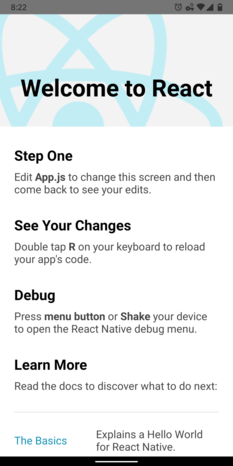
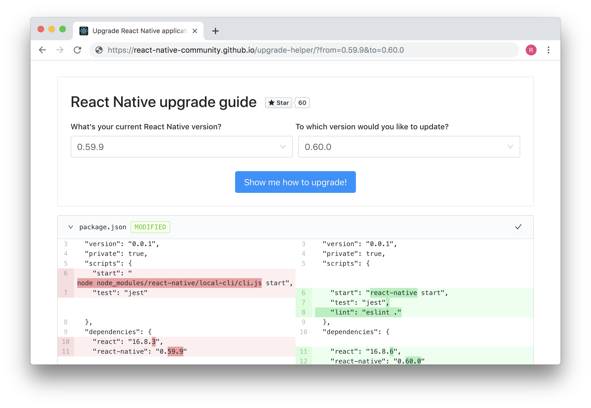

#Intro

After periods of hard work from numbers of contributors, the React Native Core team is proud to publish of new version 0.60. This release touches important migrations for both Android and iOS and many more fixed issues. This article covers the top highlights. If you would like to check more detailed information, refer to the changelog. Finally, we should cheer for all contributors who helped improve this version.

#Accessibility

The new version added many enhancements to the accessibility APIs, like 
- Several missing roles have been added for various components.
- New Accessibility States API for web support in the future.
- AccessibilityInfo.announceForAccessibility is confirmed on Android.
-  Accessibility actions will include callbacks that deal with user-defined actions.
- iOS accessibility flags and reduce motion are supported on iOS.
- A clickable prop and an onClick callback are added for invoking actions via keyboard navigation.
Accessibility is a complicated science, but we hope these changes make it a bit easier to be available to disabled users (according to A11Y). Check latest React Native Open Source Update for more details.

#Start Screen
React Native's home screen has been refreshed!  This new "Hello World" will greet users to the ecosystem in a more welcoming, engaging way.

#AndroidX Support

With this release, React Native has been moved to AndroidX (Android Extension library). As this is a major change, developers need to transfer their native code and dependencies. The React Native community created a temporary solution for this called “jetifier”, an AndroidX transition tool in npm format, with a react-native compatible style.

Users are excited about the release and reflected it to be the most important RN release.

#CocoaPods by Default

React Native for iOS comes with CocoaPods by default. It is an application level dependency manager for Objective-C Cocoa projects and Swift. Developers are suggested to check the iOS platform code using the ‘xcworkspace’ file. Additionally, the Pod specifications of internal packages have been updated to make them compatible with the Xcode projects, which will assist with troubleshooting and debugging. Assume to make some straightforward changes to your Podfile as part of the upgrade to 0.60 to bring this support. 

#Lean Core project

The team started Lean Core project to bring the React Native repository to a manageable state. They have extracted WebView and NetInfo toward separate repo. In this version 0.60, the team has completed migrating them out of the React Native repo. Also, geolocation has been extracted based on the community feedback about the new App Store policy.

#Native Modules are now Autolinked
The CLI React Native team has offered significant advances to native module linking called auto-linking! Majority situations will not require the use of the react-native link. The team, at the same time,  overhauled the linking process in general. Unlink react-native any preexisting dependencies as mentioned in the docs.

#Upgrade Helper
The team of @lucasbento, @pvinis, @kelset, and @watadarkstar have built Upgrade Helper to simplify the upgrade process. Their goal was to help React Native users with brownfield apps or complicated customizations to see what's changed among versions. Try yourself and check updated upgrading docs.

#A word to Library Maintainers
 AndroidX changes will almost absolutely require updates to your library, so be sure to cover support. If you're ready to upgrade yet, consider checking your library with jetifier to confirm that users at build time can patch your library.

Check the autolinking docs to update your configs & readme. Depending on the previous integration of your library, you may also need to make some extra adjustments. 

#Thanks!
For more details check [changelog](https://github.com/react-native-community/releases/blob/master/CHANGELOG.md) 

 
 
 

 

