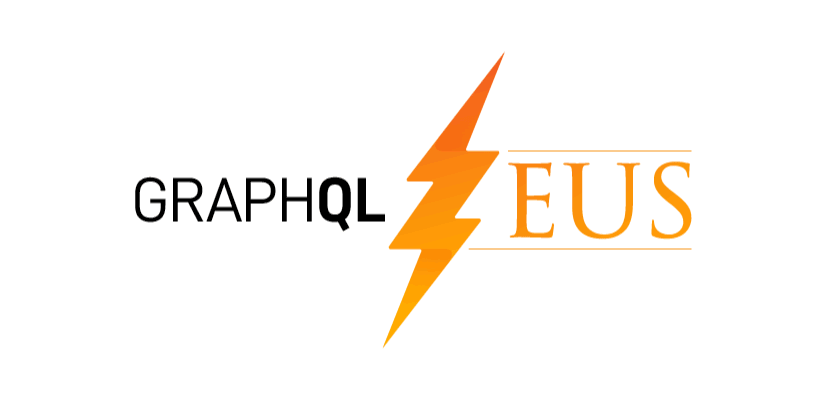

There has been a lot of buzz in the web development world around GraphQL lately and for good reason!

[GraphQL](https://graphql.org/) is a new query language for APIs and a server-side runtime for executing queries by using a **type system** you define for the data, so basically a syntax that describes how to ask for data and load it from a server to a client. 

## Why all the buzz?

The answer is simple:
> It's all about **the development speed**.

The main reason why companies started using GraphQL is that it promises to speed up your API development, what's more, it manages to deliver! 

In of the [surveys](https://medium.com/novvum/introducing-the-graphql-survey-series-insight-from-successful-graphql-adopters-3a83ff0a7e39?) directed to CTOs and lead developers of a variety of teams ranging from 1 to 100+ engineers (among which we can find tech giants like Uber or Paypal) about their perception of GraphQL implementation in their teams almost all companies felt GraphQL delivered on their expectations.

Let me introduce you three useful GrapphQL code generators to speed your development:

### 1. GraphQL Zeus

> *[Zeus](https://github.com/graphql-editor/graphql-zeus), son of Kronos, father of [Apollo](https://www.apollographql.com/).*

A simple tool working in [Node.js](https://nodejs.org/en/) & browser to generate an auto-complete client library for Javascript or Typescript. The unique thing about GraphQL Zeus is that it creates its own specification along with type-safe completion of request & responses.

### 2. Prisma GraphQLGen

The tool from Prisma team provides a type-safe environment which helps maintain confidence about your code. As creators mention the motivation behind it was to
> *"(...) leverage the strongly typed GraphQL schema with the goal of making your backend type-safe while reducing the need to write boilerplate through code generation".*

The `graphqlgen` generates & scaffolds type-safe resolvers based on your GraphQL Schema in TypeScript & Flow.

 

### 3. GraphQL Code Generator

[GraphQL Code Generator](https://graphql-code-generator.com/) is a tool that generates code out of your GraphQL schema, supporting custom plugins & templates, so regardless of the language that you're using (*i.e. TypeScript, React, Angular*) GraphQL Code Generator will be a huge help.

