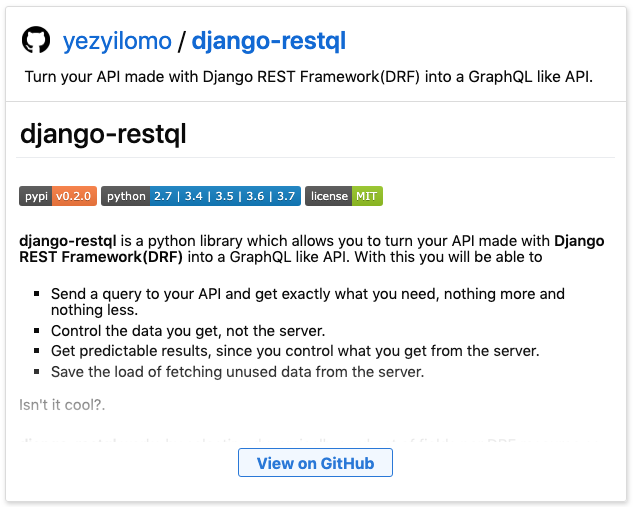
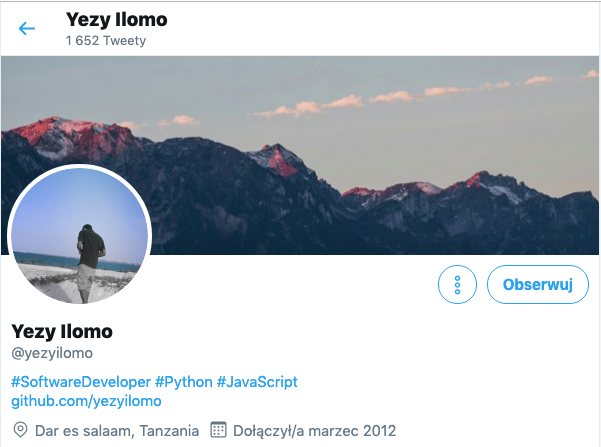

Web APIs are the motors that power most of our nowadays apps. For many years REST has been the principal architect for APIs, but in this article, we will investigate Django to GraphQL library! 

With REST APIs, you were regularly creating URLs for every object of data that's available. Thinking about REST API example for books - we'll have URLs for the books themselves, authors, prizes, characters and heroes ... it's already a lot! This could involve a lot of requests. 

With GraphQL you have one endpoint, ask what you want and get exactly that. It's is the top wanted technology according to The state of JS 2018 and every week community creates something interesting to help users adopt into new technology. [Yezyilomo](https://twitter.com/yezyilomo) came with the idea of python library that allows to turn Django Rest Framework into GraphQL like API.  Let's explore it more.

Django-restql is a library which turn your API made with Django REST Framework(DRF) into a GraphQL like API. With django-restql you will be able to: 

- Send a query to your API and get precisely what you need, nothing extra and nothing less.
- Get expected results, since you control what you get from the server.
- Control the data you get, not the server.
- Save the load of fetching unused data from the server.

The library works by choosing dynamically a subset of fields per DRF resource as specified by the request's `query` parameter.

[](https://github.com/yezyilomo/django-restql)  

Follow [Yezyilomo](https://twitter.com/yezyilomo) to get in touch with him! 

[](https://twitter.com/yezyilomo)

# Installing

```python
pip install django-restql
```

# Getting Started
Using **django-restql** is very simple, you just have to use the DynamicFieldsMixin when defining a View.

```python
from rest_framework import viewsets
from django.contrib.auth.models import User
from .serializers import UserSerializer
from django_restql import DynamicFieldsMixin

class UserViewSet(DynamicFieldsMixin, viewsets.ModelViewSet):
    queryset = User.objects.all().order_by('-date_joined')
    serializer_class = UserSerializer
```

A regular request returns all fields specified on DRF serializer, in fact **django-restql** doesn't handle this request at all:

```GET /users```

``` json
    [
      {
        "id": 1,
        "username": "yezyilomo",
        "email": "yezileliilomo@hotmail.com",
        "groups": [1,2]
      },
      ...
    ]
```

**django-restql** handle all GET requests with `query` parameter, this parameter is the one used to pass all fields to be included on a response. For example to select `id` and `username` fields from `user` model, send a request with a ` query` parameter as shown below.

`GET /users/?query=[["id", "username"]]`

```json
    [
      {
        "id": 1,
        "username": "yezyilomo"
      },
      ...
    ]
```

If a query contains nested field, **django-restql** will return its id or array of ids for the case of nested iterable field(one2many or many2many). For example on a request below `location` is a flat nested field(many2one) and `groups` is an iterable nested field(one2many or many2many).

`GET /users/?query=[["id", "username", "location", "groups"]]`

```json
    [
      {
        "id": 1,
        "username": "yezyilomo",
        "location": 6,
        "groups": [1,2]
      },
      ...
    ]
```

**django-restql** support querying both flat and nested resources, so you can expand or query nested fields at any level as long as your field is defined as nested field on a serializer. For example you can query a country and region field from location.

`GET /users/?query=[["id", "username", {"location": ["country", "region"]}]]`

```json
    [
      {
        "id": 1,
        "username": "yezyilomo",
        "location": {
            "contry": "Tanzania",
            "region": "Dar es salaam"
        }
      },
      ...
    ]
```

**django-restql** got your back on expanding or querying iterable nested fields too. For example if you want to expand `groups` field into `id` and `name`, here is how you would do it.

`GET /users/?query=[["id", "username" {"groups": [[ "id", "name" ]]}]]`

```json
    [
      {
        "id": 1,
        "username": "yezyilomo",
        "groups": [
            {
                "id": 2,
                "name": "Auth_User"
            }
            {
                "id": 3,
                "name": "Admin_User"
            }
        ]
      },
      ...
    ]
```