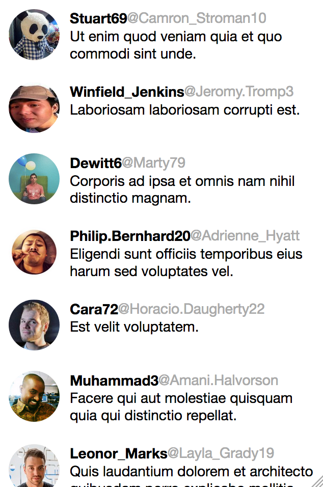

Getting started with React XP and faker is very easy. The final effect should look like this:



Whats nice about this app is the fact it is written in React XP. In this framework you get iOS, Android and tadadadam: Web. So you can just salut.


You will need to install packages in this tutorial:

[Create RX app](https://github.com/a-tarasyuk/create-rx-app). Worked for me in the first use!

```bash
$ npm install create-rx-app -g
```

[TS api faker](https://github.com/slothking-online/ts-api-faker). A small tool for receiving fake data from faker and unsplash.

```bash
$ git clone https://github.com/slothking-online/ts-api-faker
$ cd ts-api faker
$ npm install
$ npm run build
$ npm run start
```

So faker is running now its high time to create your react XP very app!

```tsx
import * as RX from "reactxp";

const _styles = {
  twitts: RX.Styles.createViewStyle({
    flexDirection: "column",
    overflow:'visible',
    alignSelf:"stretch",
    flex:1,
  }),
  twitt: RX.Styles.createViewStyle({
    padding: 10,
    flexDirection: "row",
    alignSelf:"stretch",
  }),
  text: RX.Styles.createViewStyle({
    flexDirection: "column",
    flex: 1,
    alignSelf:"stretch",
    marginLeft: 10,
  }),
  topline: RX.Styles.createViewStyle({
    flexDirection: "row",
    flexWrap:"wrap",
    alignSelf:"stretch"
  }),
  username: RX.Styles.createTextStyle({
    fontWeight: "bold",
    fontSize:14
  }),
  acc: RX.Styles.createTextStyle({
    color: "#aaa",
    fontSize:14
  }),
  avatar: RX.Styles.createImageStyle({
    width: 50,
    height: 50,
    borderRadius: 50
  }),
  sentence: RX.Styles.createTextStyle({
    alignSelf: "stretch",
    fontWeight: "normal",
    fontSize:14
  })
};
type Twitt = {
  name: string;
  acc: string;
  avatar: string;
  twitt: string;
  retwitts: string;
  likes: string;
  comments: string;
};
const fakerPayload = () =>
  ({
    name: "internet.userName",
    acc: "internet.userName",
    avatar: "internet.avatar",
    twitt: "lorem.sentence",
    retwitts: "random.number",
    likes: "random.number",
    comments: "random.number"
  } as Twitt);
const fakerQuery: Twitt[] = new Array(Math.floor(20 + Math.random() * 40))
  .fill(1)
  .map(fakerPayload);

type AppState = {
  twitts: Twitt[];
};

export class App extends RX.Component<{}, AppState> {
  state: AppState = {
    twitts: []
  };
  componentDidMount() {
    fetch("http://localhost:3000", {
      method: "POST",
      headers: {
        "Content-Type": "application/json"
      },
      body: JSON.stringify(fakerQuery)
    })
      .then(response => response.json())
      .then((twitts: Twitt[]) => {
        this.setState({
          twitts
        });
      });
  }
  public render() {
    return (
      <RX.View style={_styles.twitts}>
        {this.state.twitts.map(t => (
          <RX.View style={_styles.twitt} key={t.name}>
            <RX.View>
              <RX.Image style={_styles.avatar} source={t.avatar} />
            </RX.View>
            <RX.View style={_styles.text}>
              <RX.View style={_styles.topline}>
                <RX.Text style={_styles.username}>{t.name}</RX.Text>
                <RX.Text style={_styles.acc}>{`@${t.acc}`}</RX.Text>
              </RX.View>
              <RX.Text style={_styles.sentence}>{t.twitt}</RX.Text>
            </RX.View>
          </RX.View>
        ))}
      </RX.View>
    );
  }
}

```

You see? There is nothing to explain, but lets go with most logical part of it.

```tsx
const fakerPayload = () =>
  ({
    name: "internet.userName",
    acc: "internet.userName",
    avatar: "internet.avatar",
    twitt: "lorem.sentence",
    retwitts: "random.number",
    likes: "random.number",
    comments: "random.number"
  } as Twitt);
const fakerQuery: Twitt[] = new Array(Math.floor(20 + Math.random() * 40))
  .fill(1)
  .map(fakerPayload);
  ```

  So we are using faker nodes like `internet.userName` here. Then we generate Array with random length fill it with numbers so we can perform map on it and generating payload with fakerPayload function. 