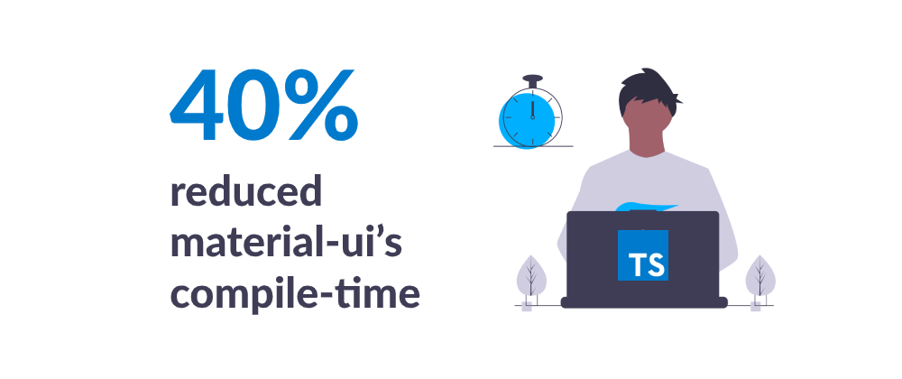

TypeScript is a superset of JavaScript which provides a lot of benefits like autocompletion, type checking, classes, interfaces, and many more. Many developers have fallen in love with it since first use and consider is a one and only choice when writing modern web apps.

Yesterday Microsoft dev team announced the release candidate version of **TypeScript 3.9 RC**. This version focuses mostly on improvements in performance and stability improvements like:

- speeding up the compiler
- improved editing experience
- removal of some bug fixes & crashes

## Performance improvements

The new version provides some serious performances improvements. After detecting poor compilation speed with material-ui packages, the series of fixed were made to improve cases involving large unions, intersections, conditional & mapped types. It is said that version 3.9 achieved a **~40% reduction in material-ui’s compile-time**.

##### Source: [undraw.co](https://undraw.co/)

## Improvements in Inference and Promise.all

Recent versions of TypeScript have had some changes to the way `Promise.all` and `Promise.race` functions are declared which generated few regressions linked to mixing `null`//`undefined` values. In 3.9 that was fixed along with some improvements to the inference process. 

## CommonJS Auto-Imports in JavaScript

A major improvement are polished auto-imports in JavaScript files using CommonJS modules. TypeScript 3.8 by default assumed that you wanted an ECMAScript-style import regardless of your file. In version 3.9 RC TypeScript automatically detects the types of imports you’re using in your project to keep your file’s style consistent.

##### Source: [devblogs.miscrosoft.com](https://devblogs.microsoft.com/typescript/announcing-typescript-3-9-rc/)

## The `awaited` Type is gone (as for now)

A new type of operator called `awaited` with a goal to accurately design the unwrapping of `Promise` in JavaScript is still in progress. The dev team decided to pull the feature out of our main branch as `awaited` is still in progress and requires some more work before they can roll it out to everyone with confidence.

--- 

Quite a lot right? And these are only some of the changes! If you would like to read more about the new version the Microsoft dev blog contains the whole list of [features and improvements available inTypScript 3.9 RC](https://devblogs.microsoft.com/typescript/announcing-typescript-3-9-rc/). 
