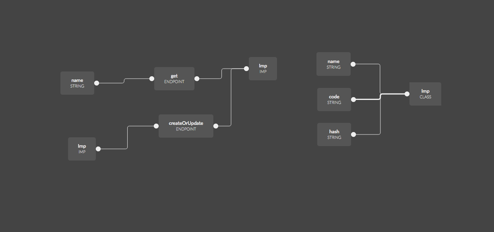

Making backend with nodejs and typescript is trendy nowadays. In this article I will show you the way how to make it type safe and totaly connected with frontend within a short period of time.

To make this kind of backend I have to use my open source experimental tool [slothking](https://slothking.online). First of all we will create a diagram for our backend. We will not use any extensions to make everything from scratch.

1. Go to [Slothking App](https://slothking.online)
2. Register.
3. Click out this diagram



Now if you have it. Save this with some fancy name. then go to slothking cli repo. [Slothking CLI](https://github.com/slothking-online/sloth)
Download it and login.

```bash
$ sloth login username password
```

Create mongodb with docker

```bash
$ docker run --rm -it -p 27017:27017 mongo:3
```

Next you have to clone backend starter or import it to your backend project it is up to you. If you want to procced with backend starter. Go ahead and download it

```bash
$ git clone https://github.com/slothking-online/backend-nodets-boilerplate
$ cd backend-nodets-boilerplate
$ npm install
$ npm run dev
```

Open another tab in terminal.

```bash
$ sloth nodets your-project-name src/generated.ts
```

It will generate file with typeguard for your script hosting platform

```tsx
import * as sloth from '@slothking-online/node'
import * as tg from 'typegoose'
import { ObjectId } from 'bson'

export type ImpType = {
  _id?: ObjectId
  code: string
  hash?: string
  name?: string
}
export class Imp extends tg.Typegoose {
  @tg.prop()
  code: string
  @tg.prop()
  hash: string
  @tg.prop()
  name: string
}
export const Models = () => ({
  ImpModel: new Imp().getModelForClass(Imp),
})

const slothking: {
  simpleImpServer: {
    name: string
    middlewares: {}
    endpoints: {
      get: sloth.SlothkingEndpoint<
        {
          name?: string
        },
        {},
        {
          Imp: tg.InstanceType<Imp>
        }
      >
      createOrUpdate: sloth.SlothkingEndpoint<
        {
          Imp?: ImpType
        },
        {},
        {
          Imp: tg.InstanceType<Imp>
        }
      >
    }
  }
} = {
  simpleImpServer: {
    name: 'simpleImpServer',
    middlewares: {},
    endpoints: {
      get: {
        path: 'get',
        middlewares: [],
      },
      createOrUpdate: {
        path: 'createOrUpdate',
        middlewares: [],
      },
    },
  },
}
export default slothking
```

So you have type definitions and mongo generated. Lets start implementing our endpoints.

1. Create a file src/implement.ts

```ts
import generated, { Models, Imp } from './generated'
import * as crypto from 'crypto'
import { InstanceType } from 'typegoose'

const models = Models()

const {
  simpleImpServer: {
    endpoints: { createOrUpdate, get },
  },
} = generated

createOrUpdate.run = async props => {
  const {
    Imp: { code, hash, name },
  } = props.context.arguments
  let ImpInstance: InstanceType<Imp>
  if (hash && name) {
    ImpInstance = await models.ImpModel.findOneAndUpdate(
      {
        hash,
      },
      {
        code,
      },
      {
        new: true,
      }
    )
  } else {
    ImpInstance = await models.ImpModel.create({
      name,
      code,
      hash: crypto.randomBytes(8).toString('hex'),
    })
  }
  return {
    Imp: ImpInstance,
  }
}
get.run = async props => {
  const { name } = props.context.arguments
  return {
    Imp: await models.ImpModel.findOne({
      name,
    }),
  }
}
export { generated }
```

Now edit the src/index.ts file

```ts
import run from '@slothking-online/node'
import { generated } from './implement'
export default run([generated.simpleImpServer], process.env.MONGO)
```

Now you have fully working gist-like server, in next tutorial I will show you how to create CLI for this kind of gist server.
