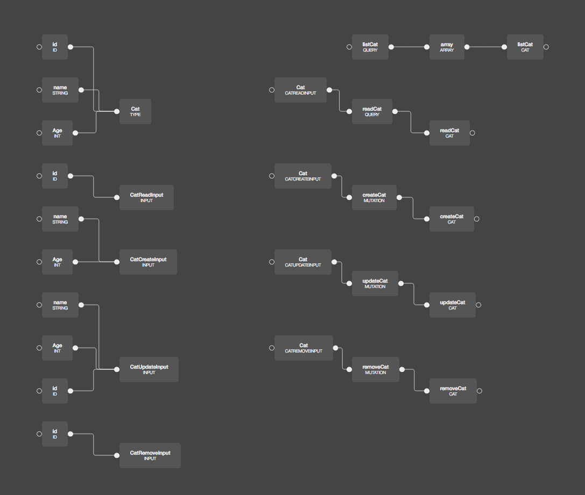

Have you ever wondered to visualise your GraphQL schema? How it looks as a tree structure?

Explaining schema would be much easier on visual like graph. So you can easily see points where you can optimise it.

```graphql
input CatReadInput {
  id: ID
}

input CatCreateInput {
  name: String
  Age: Int
}

input CatUpdateInput {
  name: String
  Age: Int
  id: ID
}

input CatRemoveInput {
  id: ID
}

type Cat {
  id: ID
  name: String
  Age: Int
}

type Query {
  listCat: [Cat]
  readCat(Cat: CatReadInput): Cat
}

type Mutation {
  createCat(Cat: CatCreateInput): Cat
  updateCat(Cat: CatUpdateInput): Cat
  removeCat(Cat: CatRemoveInput): Cat
}

schema {
  query: Query
  mutation: Mutation
}
```

Presenting this kind of text document wouldn't mean anything to sales or business person. However presenting visual diagram out of it helps them understand the whole data model



You can create those schemas just by uploading file or url to [GraphQL Editor](https://graphqleditor.com)