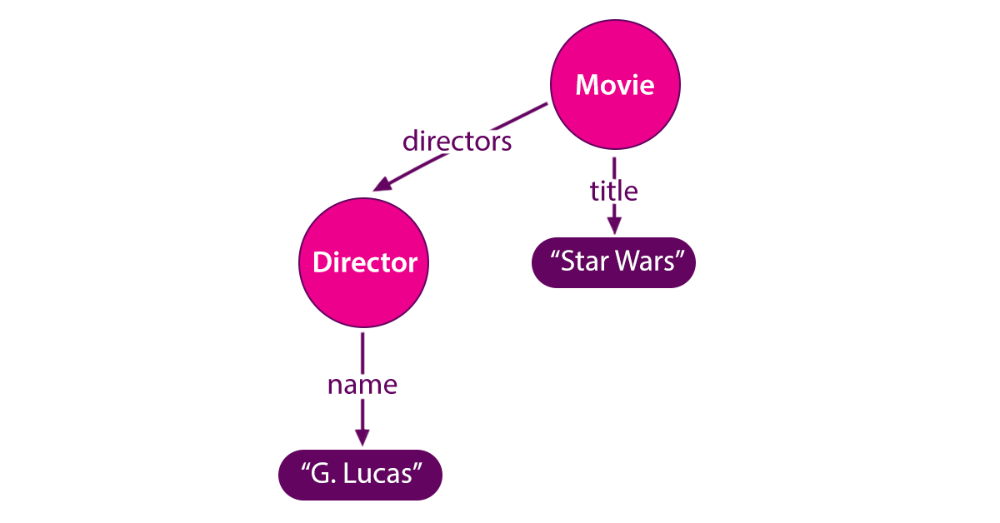
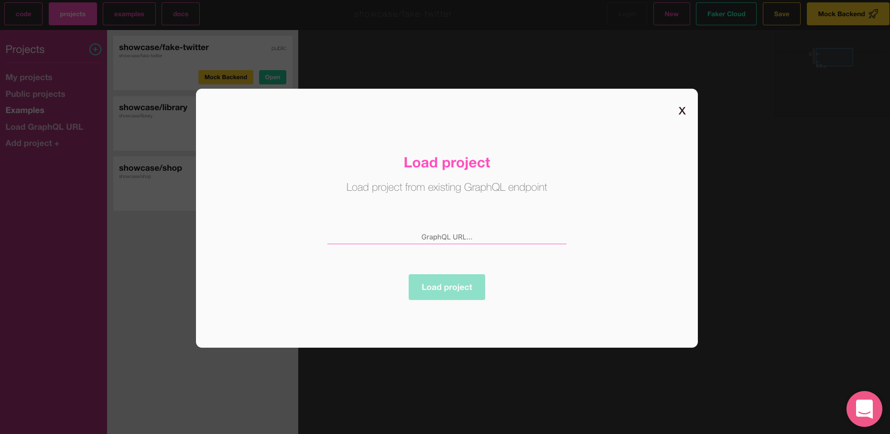
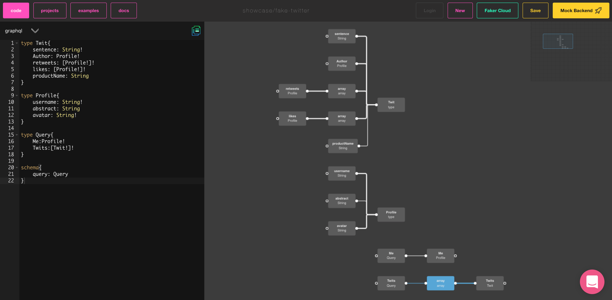

WWelcome in another episode of our Code Academy series in which we present the most interesting code related things like tools, libraries, approaches etc. This week we will cover a GraphQL schema visualization topic.


As your probably already know [GraphQL was defined by npm as one of the technologies that will dominate 2019.](https://blog.graphqleditor.com/javascript-predictions-for-2019-by-npm/)
GraphQL is a technology you must learn this year to keep up the pace of the frontend and the backend evolution. As for now, [RESTful APIs](https://blog.graphqleditor.com/graphql-vs-rest/) are the most popular choice but this will change soon. The sooner you make a decision to start the transition from REST to GraphQL the less painful its going to be. There are many tools and libraries to make it easier to convert from [REST to GraphQL](https://blog.graphqleditor.com/grapqhl-vs-rest-caching/) and there is a huge reward waiting for you at the end of the road.


## Know your schema

#### What’s a GraphQL schema and why it's so important to know it well?
The [GraphQL schema](https://graphql.org/learn/schema/) is a centerpiece of your GraphQL project.  GraphQL schema is nested in your GraphQL server and defines every functionality available to the clients. The main element of each schema is `type` which allows establishing relations between different types, define allowed GraphQL operations (Queries and Mutations) to be performed on the server and more.

To make it easier to understand the operation that a server can perform GraphQL defined a universal schema syntax know as SDL (Schema Definition Language). The SDL defines the elements of your project i.e. `type`:

```graphql
type Movie {
   title: String
   Director: Director
}

type Director {
   name: String
   movies: [Movie]
}
```
or `query` (asking the server for the data) and `mutation` (manipulating the data):

```graphql
type Query{
    getMovies: [Movie]
    getDirectors: [Director]
}
```

```graphql
type Mutation {
   addMovie(title: String, director: String) : Movie
}
```
So as you see the schema is indeed a centerpiece of any GraphQL project and it's important to be aware of what is what and where to find it. Big complicated schemas are really hard to comprehend. Let's take GitHib schema as an example, it has **9182** lines of code! It's really hard to follow... Fortunately, graphs are coming with help!


## Visualization is the key

A graph is an abstract data type. It's structure consists of a finite set of vertices, nodes or points linked together. Graphs are a great tool for shaping logic behind your app as they fit-in well for any IT project and at this point, we can agree that graphs are more accessible than code in terms of apprehending the schema.



#### Turning schema code into graphs

So how can we turn our schema code into a visual graph? It's simpler than you can imagine. We are going to use [GraphQL Editor](https://graphqleditor.com).

All you need to do is go to [app.graphqldditor.com](https://app.graphqleditor.com)and load your schema as below and ...



... and that's it!

If you have provided editor a valid schema it will automatically turn its code into a visual graph. Cool, right?


