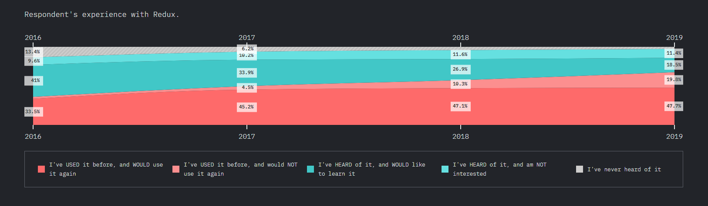

 *A guest blog post for [GraphQL Editor blog]
(https://blog.graphqleditor.com/) by Kuba Kamiński from [InfoTech](https://technikum.infotech.edu.pl/)* 

We are living in a world in which technology changes every day. The web pages older than 3 years for us it is something old and out of date. It's not surprising that web pages should be upgraded every day to become more user-friendly, efficient, aesthetic and secure. Abilities that give us these possibilities are accessible by modern web technologies.  It’s important for web programmers who want to stay at the top of their game and for newcomers looking for their first job. Today we will be looking at the most wanted of them in 2020. So the web programming frameworks are divided into three groups: frontend, backend & data layer.

## FRONTEND LAYER
At the overlap called *frontend frameworks*, we can see the top 3 of the most used web languages. These are the most appreciated frontend frameworks by respondents:

### React

[React](https://reactjs.org/) is a JavaScript framework that provides an option to create a user interface. React was released on March 1, 2013. It is declarative to make a work painless to create interactive UIs. As we can observe the number of programmists that are using this language is increasing year by year. On the label, we can see the number of users that have tried React but would not use it again is quite small. React has a dominant position among frontend frameworks.

### Vue.JS

Vue.js is a progressive framework for building user interfaces. What changes Vue from others is designed from the ground up to be incrementally adoptable. The first release of vue.js was February 2014. The Vue.js wasn't quite popular since 2016. As we can see in 2017 people started the interest in this language. Still, this language is very low on usage in everyday tasks. The number of people that are using Vue is increasing, but the number of users willing to learn is lowering year by year.

### Angular
Angular is a cross-platform, fast and very performant frontend framework allowing you to quickly create UI views. Simple, yet powerful template syntax, high-performance, complex choreographies makes Angular a solid player among frontend frameworks with a pretty strong community using it on a daily basis.

## BACKEND LAYER
At the tuck called “back end frameworks” under it, we got seven other tucks with the language but I will focus on the top 3. Upcoming languages are:

### Express

[Express](https://expressjs.com/) is a Node.js web application framework that provides a robust set of features for web and mobile applications. Express is a front-end framework that uses HTTP utility methods. The number of peoples that are using it on a daily basis is pretty high.

### NEXT.js

[Next.js](https://nextjs.org/) is a static site generator with a lot of useful features like customizable server, routing, plugins as well as complete control over Babel and Webpack.  Next.js is relatively and its popularity hasn't skyrocket yet but I am sure it will very soon.

### Koa

[Koa](https://koajs.com/) is a new web framework designed by the team behind Express, which aims to be a smaller, more expressive, and more robust foundation for web applications and APIs. The number of users that are using koa is still low but it's definitely a framework to follow.

## DATA LAYER

At the tuck called data layer, we can see under it more overlaps with the names of the programming languages to work on data layer:

### Redux

[Redux](https://redux.js.org/) is a data layer programing language that works as a javascript apps container. It’s centralizing all your apps to let you undo/redo state persistence. Redux lets you easily change things. The percents of users using Redux is increasing rapidly. In the two last years, the percentage of people that never heard of it didn’t increase enough.
  

### GraphQL

[GraphQL](https://graphql.org/) is an amazing opportunity to maximize your efficiency on your web page. GraphQL is a query language for your API, and a server-side runtime for executing queries by using a type system you define for your data. GraphQL was getting his fame in 2017 when the number of users that didn’t know this language downgrade by almost half. The number of voters that want to learn it was highering in the years 2017-2018 but in 2019 the percent lowered and the percent of the users that are using it on a daily basis was bigger. 

