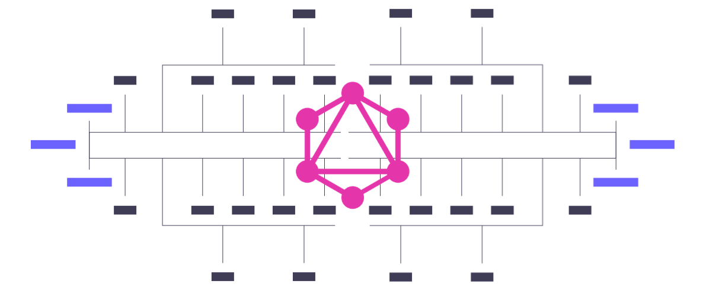
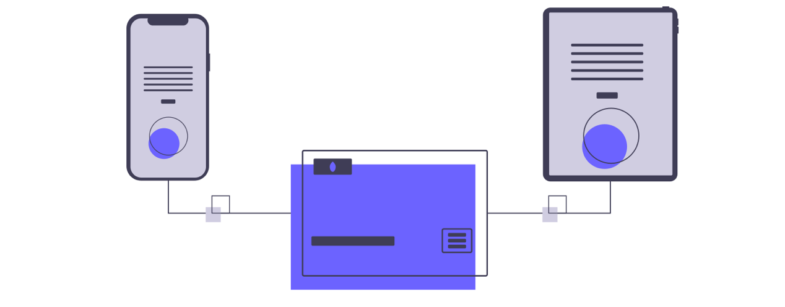
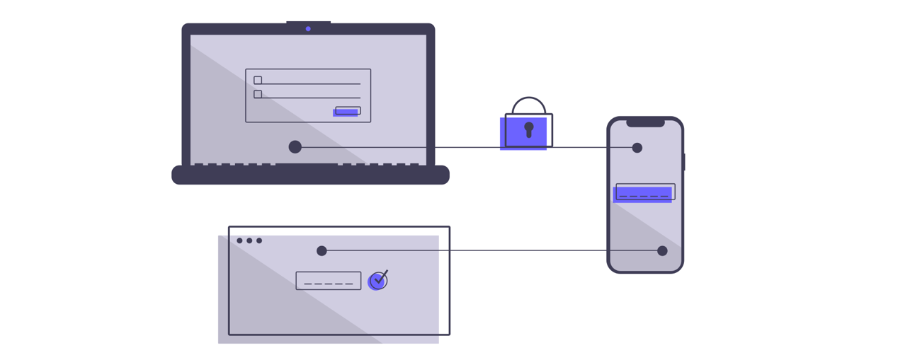

One of the core notions of using [GraphQL](https://graphqleditor.com/) is a schema. It strictly defines the potential an API might have by forming a set of concepts and relations between them. Another crucial function of a schema is regulating how and by using which action data can be accessed.

Designing a schema is one of the first steps in the development process, casting a shadow over the following tasks. Due to how many areas are affected by a schema, later on, its architecture should be carefully planned. This, hopefully, leads to a naturally evolving, intuitive, and most importantly secure product.

##### Source: [undraw.co](https://undraw.co/)

## Scaling
Attempting to adjust a project which wasn't designed with greater scope in mind can be quite a headache. Adding something which seems inconspicuous to the end-user may involve a long list of tedious tasks. Deprecating pre-existing concepts, adding new ones only to be renamed a while later, keeping track of what has and what has not been yet modified. This process only gets more complex with every such change required. This can be avoided by following a few simple rules in scalable schema design.

##### Source: [undraw.co](https://undraw.co/)

##### Keep it simple
The goal of using [GraphQL is to create something transparent](https://blog.graphqleditor.com/what-offers-graphql-api/), easy to understand for everyone involved. However, this is made impossible if a schema can be compared to a labyrinth of connections and sources of data. Think about the developer who comes after you have moved on to other projects. An example of good practices can be using input object type for mutations.

##### Force yourself to be adaptable
To avoid the aforementioned headache in scaling, a schema should be easily adjusted to specific, often unforeseen, requirements. It is often the case that many concepts must be deprecated at once, whereas other ones need to be added without breaking the rest. A good way of doing this is using the tools given by [GraphQL](https://graphql.org/) itself, as opposed to creating one's own. Custom-made tends to be more convenient at the time, but it is less comprehensive looking from the outside.

##### Be creative & specific
Being a little bit more creative when designing a schema tends to pay off in the long run. Instead of going for the easy way out and using something generic, make the type name more specific. When in doubt, consult other people involved in the project, they may have some interesting ideas about how and for what reason you should name a concept in a certain way.

## Security
Carelessly drawn-up schemas may create various possibilities for malicious attacks in different ways. An example of such behavior is exposing data in unanticipated ways.

##### Source: [undraw.co](https://undraw.co/)

##### Think about proper pagination
One of the preventative measures can be proper pagination. This is a feature which is not provided by the language itself, it is mostly left to the imagination of the developer. There are many different ways in which pagination can be implemented, which makes the choice that more difficult. It is imperative to take into account the needs of the project, rather than personal preference. 

##### Don't overload the client-side
Allowing the clients to manipulate data is generally frowned upon since it can give birth to a multitude of issues. It is a much better idea to keep as much as possible server-side, most preferably batched in a single large request, as opposed to multiple small ones. This has a two-pronged effect: reduces the amount of data that needs to be repeatedly loaded, and simplifies the result for the end-user.

Do not leave schema design to chance. Make it a group project, spend a couple of sessions together, brainstorming ideas and collaborating with everyone who has something to do with all the data. Hopefully, this leads to a good schema: 

- one that is functional, 
- malleable and easy to understand.

Future you will surely thank you later.

---

*A guest blog post for [GraphQL Editor blog]
(https://blog.graphqleditor.com/) by Carl Matte; Sources: [Do’s & Don’ts for your schema and GraphQL operations](https://www.youtube.com/watch?v=fG8zy1OROp4), [atheros.ai](https://atheros.ai/blog/graphql-best-practices-for-graphql-schema-design), [apollographql.com](https://blog.apollographql.com/graphql-schema-design-building-evolvable-schemas-1501f3c59ed5)*
