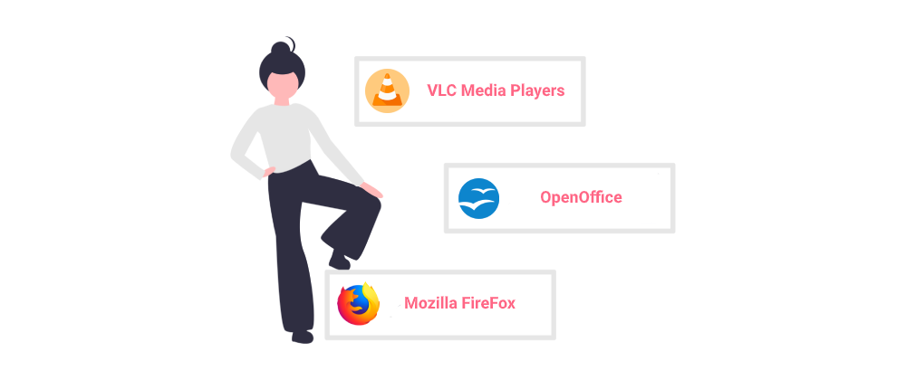

If you’ve read a little bit about software licensing or Linux you probably know a few things about copyleft and it’s restrictions and requirements. If not and you’re just curious about what copyleft is, welcome anyway.

## A little history

To give you a bit of history, copyleft is a concept created in the mid-80s by **Richard Stallman**. Long story short, he was working on a Lisp interpreter and when another company called Symbolics asked him if they could use it, he provided it to them via public domain. Symbolics improved the interpreter, but when Stallman wanted to access those improvements they refused. This highlighted a pretty big flaw in using the public domain, especially for cooperative works. Anyone could break away at any time and restrict access to their modifications.

This prompted Stallman to create a new type of license called **Emacs General Public License** (this later evolved into the popular GNU GPL). The concept was based around four freedoms:

- **freedom 0** - to run the program in any way and for any purpose
- **freedom 1** - to study the source code and change it
- **freedom 2** - to copy and share the program with others
- **freedom 3** - to distribute copies of your modified version

This however was not yet copyleft. In order to protect those rules from being changed a further rule had to be added, that all derivative works also follow those same rules. So that the author of a modified or improved version could not impose any restrictions that violate those basic rules. Today it simply means that any modified or improved version has to be distributed under the same type of license i.e. copyleft.

##### Credits: [undraw.co](https://undraw.co/)

These rules allow a certain degree of flexibility as long as it does not infringe on their basic premise. For example you can require modified versions to use a different name or logo than yours or to identify their modifications.

## Advantages

**Copyleft licenses** are sometimes referred to as *viral licenses* because all derivative work ‘carries’ the copyleft license. Despite that moniker, there are actually significant advantages to using them:

- preventing companies from using software and giving nothing back to the community,
- preventing others from using your work to create a competing product.

The first argument being a reference to situations like the above-mentioned Symbolics affair. The second refers to cases where a company can create a product that will compete with yours by using your own code. Taking into account that it may also have significantly more resources available it might not be a fair competition at all.

## Strong vs weak copyleft

Another advantage is that the **copyleft is quite flexible in applying its core rules**. This has led to two main branches of licenses called strong and weak copyleft.

- **strong copyleft** -  means the provisions of the original license are imposed on all derivative work. Derivative work can be relicensed under a different copyleft license, but only if it is compatible with the original license. The most popular examples are GNU GPL and EU Public License.

- **weak copyleft** - is a compromise between strong copyleft and permissive licenses. It allows more flexibility in the provisions such as linking from code licensed under different types of licenses (even non-opensource ones) or incorporating code in larger software (even if it isn't copyleft). The most popular examples are LGPL and the Mozilla Public License.

## Popularity

All in all, copyleft remains immensely popular among developers, even though it has been declining for the past few years. According to WhiteSource three of the six most widely used licenses are copyleft with versions two and three of GPL carrying the torch. Lots of popular programs like **VLC media player, 7-zip, Firefox, and Openoffice are licensed under copyleft licenses**.

##### Credits: [undraw.co](https://undraw.co/)

## Read up

Most developers advise those considering a copyleft license for their work to think about the long term plans and goals of their project. Another important factor is considering the environment where you want your project to fit in, platform or language, and how compatible your chosen license is with those most used there. So read up before you make up your mind.
