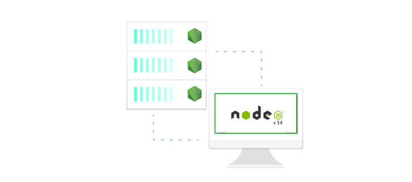

It's official, **Node.js v14** is live and it's packed with new awesome features. The highlights in this release include an upgrade of V8 and many other improvements. Let's see what has changed and what's new 

## What's new in Node.js v 14

Node.js is a JavaScript runtime using an event-driven I/O model which makes it extremely efficient when it comes to making scalable network applications.
Node.js offers a lot for developers and the latest version adds even more!

### 1. V8 engine upgraded to version 8.1 

The new version of JavaScript engine bringing performance improvements as well as some new features like:

- **Optional Chaining** - which allows accessing the value of a property located deep within a chain of connected objects without the need to expressly validate that each reference in the chain,
- **Nullish Coalescing**  - a logical operator returning its right-hand side operand when its left-hand side operand is null/undefined (and otherwise returning its left-hand side operand),
- **`Intl.DisplayNames`** - providing the consistency of language, region, and script display names translations,
- **`Intl.DateTimeFormat`** - `calendar` and `numberingSystem` options enabled.

### 2. Experimental Web Assembly System Interface

The 14.x release includes an experimental implementation of the Web Assembly System Interface (WASI) in order to provide better performance, cross-platform support, and could drastically simplify usage of native modules.

##### Credits: [undraw.co](https://undraw.co/)

### 3. Experimental Async Local Storage API

The numerous attempts to manage context across Async Calls resulted in experimental Async Hooks API being introduced in earlier versions of Node.js. As Async Local Storage was a key use case of Async Hooks API, the 14.x release brings an [experimental Async Local storage API](https://nodejs.org/api/async_hooks.html#async_hooks_class_asynclocalstorage). 

### 4. Diagnostic Report goes Stable

The diagnostic report was originally released in v12 as an experimental feature. in v14 it's been promoted to a stable feature. It provides triggered/on-demand reports containing useful insights about issues occurring on production including but not limited to unexpected errors, crashes, memory leaks, extensive CPU usage etc.

### 5. Hardening of the streams APIs

Latest release contains numerous changes to Streams implementation aiming to improve consistency across the Streams APIs i.e.:
- `http.OutgoingMessage` is similar to `stream.Writable` 
- `net.Socket` behaves exactly like `stream.Duplex`.
- `autoDestroy` option is set 'true' by default and makes stream always call `_destroy` after ending

### 6. Removal of Experimental Modules Warning

Despite the need to include the `experimental-modules` flag was removed in v13 running EcmaScript Modules in Node.js would still result in a warning `ExperimentalWarning: The ESM module loader is experimental`. This warning was removed in v14 but the ESM implementation still remains experimental so be cautious when using ESM in production environments.

Quite a lot right? Node.js 14 will be the `Current` release for the next 6 months and then promoted to Long-term Support (LTS) in October 2020. This update looks really awesome and if you can't wait to get your hand on it [download Node.js version 14](https://nodejs.org/en/download/current/).
