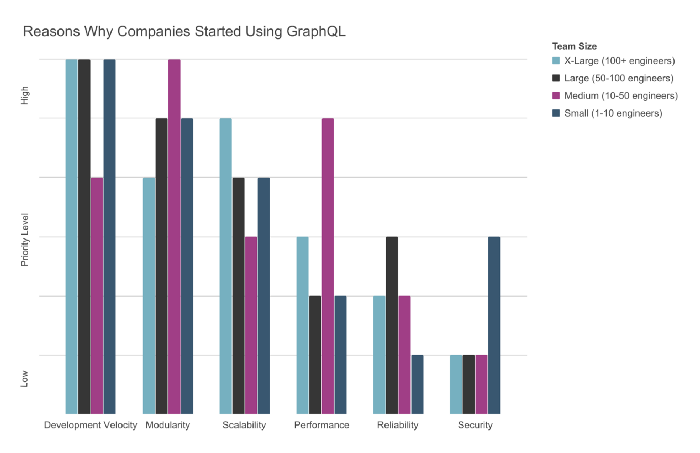
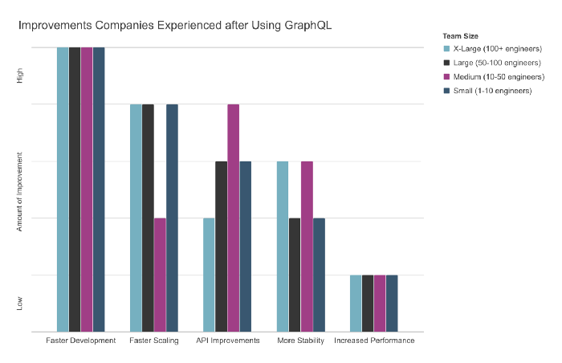

[GraphQL](https://graphqleditor.com/) is a query language for APIs that was originally built by Facebook, it describes how to ask & fetch the data from the server to the client, what's unique the response format is described in the query and defined by the client rather than the server. 

By the end of 2018, the [npm Inc.](https://www.npmjs.com/) published its [annual prediction](https://blog.graphqleditor.com/javascript-predictions-for-2019-by-npm/) about the insights and predictions about JavaScript for 2019, where they mentioned that:

> *There is a strong likelihood that developers will use GraphQL in new projects in 2019 and the GraphQL will become a technical force to reckon in 2019.*

Guess what? They were right! More and more companies are adopting GraphQL with tremendous success!

#### Why Companies are Adopting GraphQL?

The survey made by one of [the GraphQL adopting companies](https://medium.com/novvum/introducing-the-graphql-survey-series-insight-from-successful-graphql-adopters-3a83ff0a7e39) asked the CTOs and lead developers of a variety of companies about their experience with the implementation of [GraphQL](https://graphqleditor.com/) & its results. They made a great job gathering data from both top [companies like Uber, Paypal](https://graphql.org/users/), as well as those with smaller/medium development teams ranging from 1 to 100+ software engineers. 

The result of the survey gives us insights on:

- why they have chosen to **implement GraphQL**,
- what **obstacles they faced** during the transition process,
- what **main benefits** they were able to identify after the successful implementation.

Let's take a look at the questions the developers had to face.

#### Questions & answers

Well, technically these are not questions, but the survey asked responders to rank reasons why they decided to pivot in a scale from 1–6, where 1 is most important reason & 6 is least important. The makers of the survey identified six main benefits (*Development Velocity, Modularity, Scalability, Performance, Reliability, Security*), and asked how strongly they agree/disagree with the following statements:

> *We were able to speed up our development using GraphQL*
>
> *We were able to scale our projects faster with GraphQL*
>
> *It was easier to unify our APIs (e.g., Microservices, legacy endpoints, third-party services, etc.)*
>
> *There has been an increase in performance using GraphQL*
>
> *Our architecture is more stable, with decreased downtime, and fewer errors*

Here are the results:

###### Source: [Movvum @medium](https://medium.com/novvum/why-companies-of-various-sizes-chose-graphql-and-what-they-experienced-7a9d47d06bee)

The interpretation of the survey's results was summed up closed in the table below. The most important thought is that GraphQL managed to provide what teams were looking for that small to medium as well as large enterprise teams. 

|Team size| What they wanted to achieve|What they've achived|
|---|---|---|
|50-100 & 100+ devs|Faster development speed, better scalability, better modularity|Faster development, better scalability|
|10-50 devs|Better modularity, higher performance|Faster development, better infrastructure|
|up to 10 devs|Faster development, better modularity|Faster development, better scalability|

#### Bonus: Get inspired!

If somehow you haven't seen it make sure to check out the documentary about the GraphQL origins and how it became what it is now. A great production starring co-creators of GraphQL: Lee Byron, Dan Schafer, and Nick Schrock as well as other big names from the community.

> *GraphQL: The Documentary" explores the story of why and how GraphQL came to be and the impact it's having on big tech companies worldwide, including Facebook, Twitter, Airbnb & Github.*

